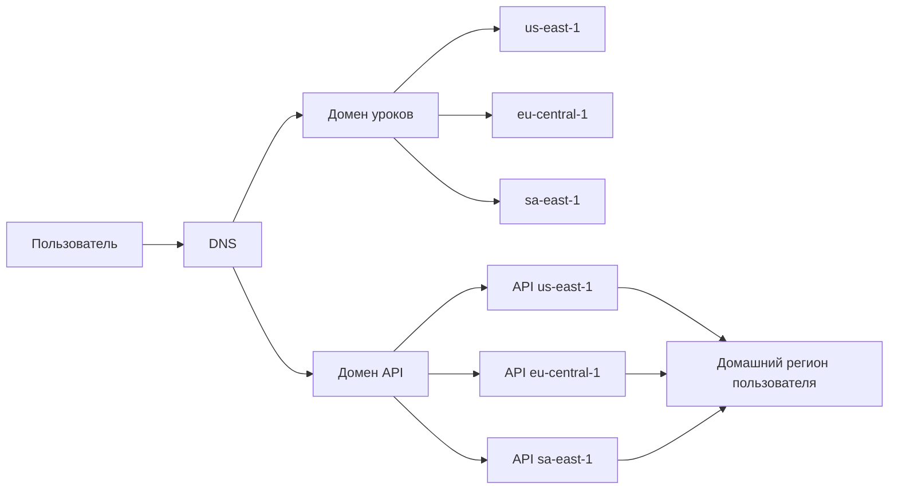
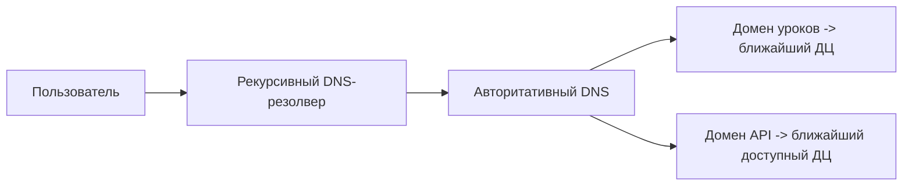
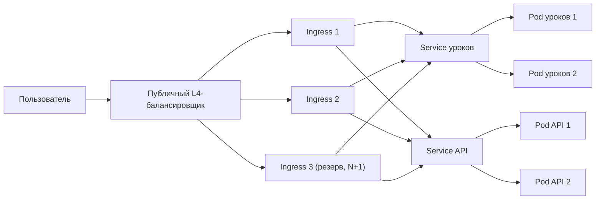
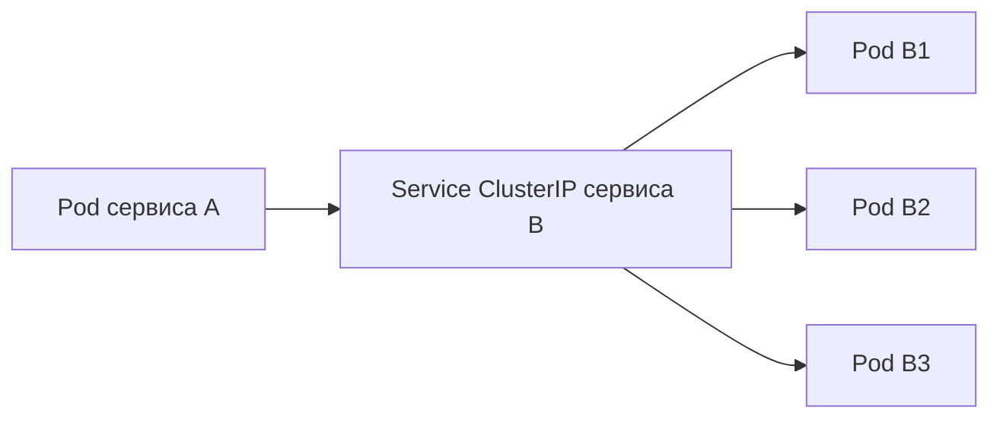
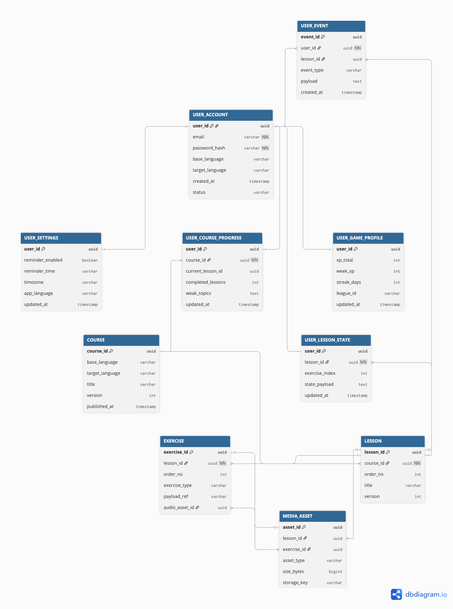
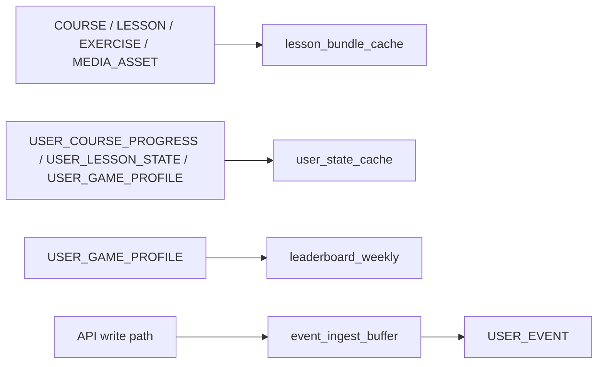
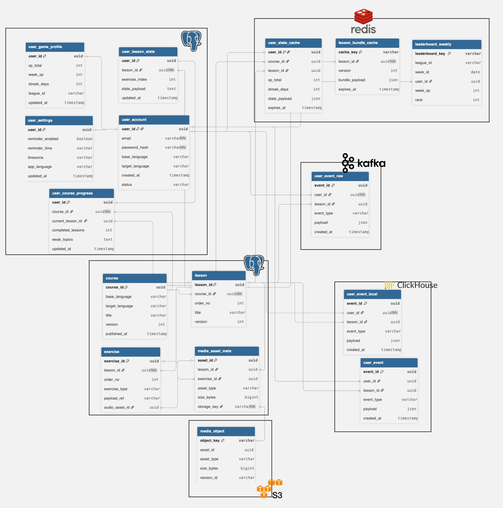
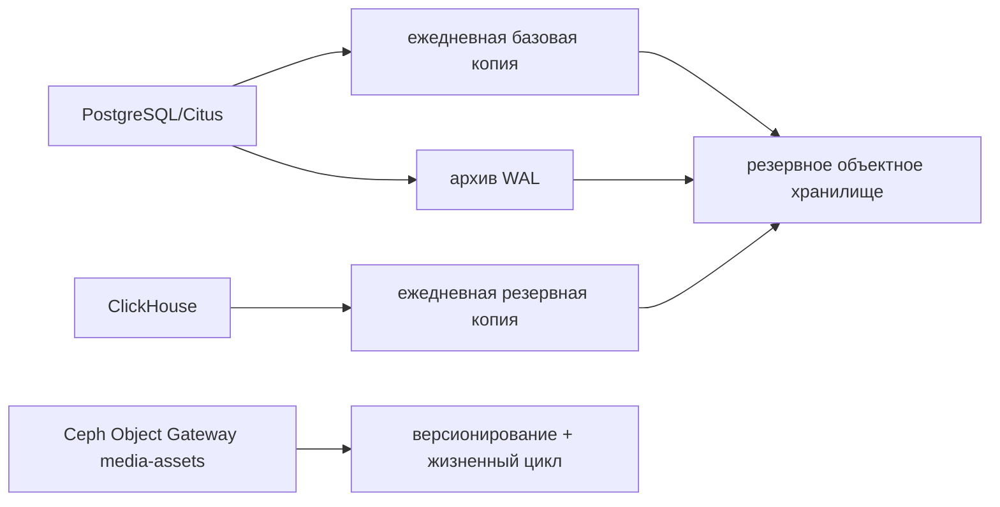
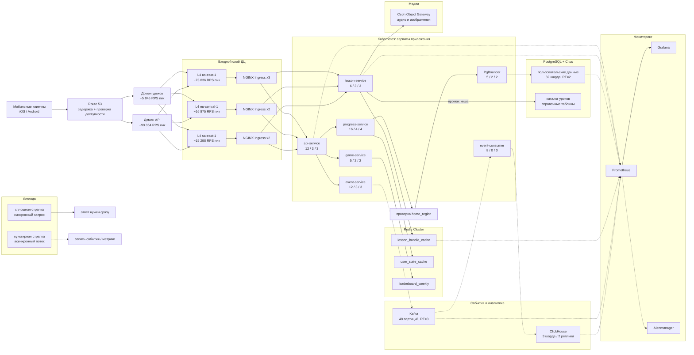

# 1. Расчетно-пояснительная записка

## Сервис для изучения иностранных языков

### Описание и аналоги

#### Описание

Сервис для изучения иностранных языков — онлайн мобильное приложение, позволяющее по коротким интерактивным урокам с персонализацией и геймификацией поддерживать регулярное изучение иностранных языков.

#### Аналоги

Существует несколько больших аналогов: Duolingo, Babbel, Memrise.

### Ключевые особенности 

- короткие сессии 2-5 минут
- "submit answer" — частые записи ответов
- большие пиковые нагрузки (утро/вечер)

### Аудитория 

Основная аудитория проектируемого сервиса — пользователи в возрасте 20-45 лет, основная группа — 25-34 года. Объем аудитории — ~130 млн пользователей в месяц. Это значение соответствует аналогичному сервису Duolingo по количеству пользователей в месяц на мировом рынке ([1](#список-источников), [2](#список-источников), [3](#список-источников)).

### Функциональные требования

- Регистрация пользователя, выбор языка
- Персонализация контента под пользователя
- Прохождение уроков 
- Прогресс пользователя
- Проверка ответов и начисление наград
- Лидерборды (недельные рейтинги)

### Ключевые продуктовые решения

- Геймификация процесса обучения: каждое действие — событие (ответ, завершение урока, серия занятий и т.д.)
- Персонализация обучения: рекомендации по повторению "западающих" тем
- Короткие сессии обучения (2-5 минут)

# 2. Расчет нагрузки

## Продуктовые метрики 

| Метрика                                         | Значение                     | Комментарии                                                  |
| ----------------------------------------------- | :--------------------------- | ------------------------------------------------------------ |
| MAU                                             | ~130,000,000 человек в месяц | Источник [[2](#список-источников)]                           |
| DAU                                             | ~50,500,000 человек в день   | Источник [[2](#список-источников)]                           |
| Средний размер хранилища пользователя в шт.     | 1                            | [Расчет среднего размера хранилища пользователя](#Расчет среднего размера хранилища пользователя) |
| Средний размер хранилища пользователя в Гб      | ~0.6 Кб                      | [Расчет среднего размера хранилища пользователя](#Расчет среднего размера хранилища пользователя) |
| Среднее количество действий пользователя в день | 77                           | [Расчет среднего количества действий пользователя в день](#Расчет среднего количества действий пользователя в день) |

####	Расчет среднего размера хранилища пользователя

Для каждого пользователя в основном сохраняется прогресс и текущее состояние.

| Тип хранимых данных                    | Среднее количество | Оценка размера записи | Объем хранилища |
| -------------------------------------- | ------------------ | --------------------- | --------------- |
| Профиль пользователя                   | 1                  | 256 байт              | 256 байт        |
| Прогресс по курсу                      | 1                  | 160 байт              | 160 байт        |
| Состояние (текущая позиция)            | 1                  | 64 байт               | 64 байт         |
| Игровой профиль (XP/streak)            | 1                  | 64 байт               | 64 байт         |
| Пользовательские настройки и reminders | 1                  | 64 байт               | 64 байт         |
| Все данные                             | 5                  | -                     | 608 байт        |

### Расчет среднего количества действий пользователя в день

Точного количества действий пользователя в день в официальных источниках нет. Для оценки используются среднее число уроков и среднее время сессий пользователя в день.

Из официального источника [4](#список-источников) видно, что в среднем пользователь проводит около 15 минут сессий в день, что соответствует 3 сложным или 5 простым урокам. В расчете берется среднее значение:
$$
Lessons_{avg} = \frac{3 + 5}{2} = 4
$$
Каждый урок включает в себя несколько действий:

* открытие lesson / path — 1 действие

* запуск lesson — 1 действие

* завершение lesson — 1 действие

* обновление прогресса, XP и streak — 1 действие
* прохождение урока: для оценки берется `15` вопросов — 15 действий

Тогда получается, что каждый урок в среднем занимает порядка 19 действий:
$$
Action_{lesson} = 19
$$

Также учтем одно дополнительное действие в день (например открытие личного профиля или leaderboard)
$$
Action_{extra} = 1
$$

Тогда среднее количество действий пользователя в день:
$$
Actions_{day} = Lessons_{avg} * Action_{lesson} + Action_{extra} = 4 * 19 + 1 = 77
$$

## Технические метрики

### Размер хранения

Для сервиса учитываются три крупных класса данных:

* Пользовательские данные — профиль, прогресс, XP, streak, настройки
* Каталог контента — сами курсы, тексты уроков, JSON-структуры упражнений, изображения, аудио
* Операционные логи — отправка ответов пользователя

#### Принятые оценки

| Параметр                                         | Значение | Основание                                                    |
| ------------------------------------------------ | -------- | ------------------------------------------------------------ |
| Количество курсов                                | 280+     | Официальный Duolingo Language Report 2025 [[5](#список-источников)] |
| Количество аудиофайлов                           | 200+     | Официальный запуск Music [[5](#список-источников)]           |
| Пользователей в месяц                            | 130 млн  | Принято в расчётах выше                                      |
| Ответов на пользователя в день                   | 60       | Из расчёта `4 урока × 15 ответов`                            |
| Старта и завершений урока на пользователя в день | 8        | Из расчёта выше                                              |
| Размер одного события                            | 128 байт | [Инженерное допущение для MVP](#оценка размера хранения событий) |
| Retention raw events                             | 30 дней  | Инженерное допущение для MVP                                 |

#### Итоговая таблица

| Параметр                       | Значение     | Основание                                                    |
| ------------------------------ | ------------ | ------------------------------------------------------------ |
| Хранение данных пользователей  | 79.04 Гб     | [Расчет пользовательского состояния](#Расчет пользовательского состояния) |
| Хранение информации об уроках  | 28 Гб        | [Расчет каталога уроков](#Расчет каталога уроков)            |
| Хранение событий               | 14.93 Тб     | [Оценка размера хранения событий](#Оценка размера хранения событий) |
| Пиковое потребление            | 16.38 Гбит/c | [Трафик пользователей за сутки](#Трафик пользователей за сутки) |
| Среднее потребление            | 6.552 Гбит/с | [Трафик пользователей за сутки](#Трафик пользователей за сутки) |
| Суммарное суточное потребление | 70769 ГБ     | [Трафик пользователей за сутки](#Трафик пользователей за сутки) |

#### Расчет пользовательского состояния

$$
Storage_{user} = 130.000.000 * 608 байт = 79.04 Гб
$$

#### Расчет каталога уроков

##### Оценка размера курса

В официальных источниках не публикуется информация о размерах метаданных для одного курса. Поэтому используется средняя оценка размера одного курса:

Размер курса оцениваем через декомпозицию на уроки и упражнения.
В среднем курс содержит ~200 уроков. Один урок включает ~15 упражнений.

Для каждого упражнения:

- текстовые данные ≈ 300 байт
- аудио ≈ 2 секунды при 16 kbps → ~4 КБ
- часть упражнений сопровождается изображениями (~3 на урок, ~100 КБ каждое)

Тогда:
$$
Size_{lesson} ≈ 4.5 Кб (текст) + 300 Кб(изображения) + 60 Кб (аудио) ≈ 365 КБ
$$

$$
Size_{course} ≈ 200 × 365 КБ ≈ 71 МБ
$$

С учетом служебных данных и overhead:
$$
Size_{course} ≈ 90–100 МБ
$$

$$
Storage_{lessons} = 280 курсов * 100 Мбайт = 28 Гб
$$

#### Оценка размера хранения событий

Для расчета хранения событий фиксируются основные действия горячего пути и дополнительные события приложения:

* отправка ответа — фиксируются ответы пользователя
* старт урока — фиксируется время прохождения и факт начала урока
* завершение урока — фиксируется время и факт окончания урока
* обновление прогресса и игровых метрик — фиксируется изменение прогресса, опыта и серии дней
* открытие профиля или лидерборда — фиксируется дополнительное действие пользователя

Ранее рассчитывали среднее количество действий пользователя в сутки:
$$
Actions_{day} = Lessons_{avg} * Action_{lesson} + Action_{extra} = 4 * 19 + 1 = 77
$$
Тогда количество событий в день:
$$
Events\_Per\_Day = DAU * 77 = 50.500.000 * 77 = 3.888.500.000
$$
Средний размер события принимается равным `128 байт`. Точного размера события в официальных источниках нет, поэтому значение берется как инженерная оценка для хранения основных метаданных события.

Тогда место под хранение событий за `30` дней:
$$
Storage_{events} = Events\_Per\_Day * Size_{event} * Retention\_Row\_Events
$$

$$
Storage_{events} = 3.888.500.000 * 128 байт * 30 = 14.93 Тб
$$

### Сетевой трафик

Для проектируемого сервиса основной сетевой трафик формируется из двух крупных типов:

* Загрузка уроков — текст урока, изображения и аудио;
* API-события — отправка ответов, старт/окончание урока.

#### Трафик пользователей за сутки

Загрузка контента урока:
$$
Traffic\_lesson = Lessons_{avg} * Size_{lesson} = 4 * 365 КБ = 1460 КБ
$$
Трафик от пользовательских событий:
$$
Traffic\_Events = Actions_{day} * Size_{event} = 77 *128байт = 9.5 КБ
$$
Тогда трафик на одного пользователя:
$$
Traffic\_User = 1460КБ + 9.5КБ = 1.435 МБ
$$
Расчет в Гбит/с выполняется для всех пользователей. Для пикового значения используется коэффициент `2.5`.
$$
Traffic\_Total = DAU * Traffic\_User = 50.500.000 * 1.435 МБ = 70769 ГБ = 566152 Гбит
$$

$$
Traffic_{avg} = \frac{Traffic\_Total}{86400 секунд} = \frac{566152 Гбит}{86400 секунд} = 6.552 Гбит/с
$$

$$
Traffic_{peak} = Traffic_{avg} * 2.5 = 6.552 Гбит * 2.5 = 16.38 Гбит/с
$$

| Пиковое потребление | Среднее потребление | Суммарное суточное потребление |
| :-----------------: | :-----------------: | :----------------------------: |
|    16.38 Гбит/c     |    6.552 Гбит/с     |            70769 ГБ            |

#### RPS

Для RPS отдельно считаются основные запросы горячего пути. Обновление прогресса выполняется при завершении урока, а дополнительное действие из расчета `77` действий учитывается в событиях, но не выделяется отдельной строкой API.

| Загрузка урока | Старт урока | Окончание урока | Отправка ответов |
| :------------: | :---------: | :-------------: | :--------------: |
|       4        |      4      |        4        |        60        |

$$
RPS_i = \frac{DAU * Request_i}{86400 секунд}
$$

|     Действие     | RPS в среднем | RPS пиковый | Запросов в сутки |
| :--------------: | :-----------: | :---------: | :--------------: |
|  Загрузка урока  |     2338      |    5845     |   202 000 000    |
|   Старт урока    |     2338      |    5845     |   202 000 000    |
| Окончание урока  |     2338      |    5845     |   202 000 000    |
| Отправка ответов |     35069     |    87674    |  3 030 000 000   |
|      Всего       |     42083     |   105209    |  3 636 000 000   |

# 3. Глобальная балансировка нагрузки

По Similarweb [3](#список-источников) среди раскрытых стран трафик duolingo распределен как минимум между несколькими регионами:

* США и Канада — `32.47%`;
* Бразилия — `6.80%`;
* Германия и Великобритания — `7.50%`;
* остальные страны — `53.23%`.

Для проектирования используется статистика распределения трафика Duolingo.

В глобальной конфигурации используются три ДЦ:

* `us-east-1` — ДЦ с самой большой долей нагрузки;
* `eu-central-1` — европейский ДЦ;
* `sa-east-1` — южноамериканский ДЦ.

Основная часть сетевого трафика приходится на выдачу уроков, а каталог уроков занимает всего `28 ГБ`, поэтому он реплицируется между несколькими ДЦ. API тоже принимается в ближайшем ДЦ, иначе почти вся нагрузка ушла бы в США и задержка для пользователей из Европы и Южной Америки была бы выше.

Для пользовательского состояния используется домашний ДЦ пользователя. Внутри этого ДЦ прогресс, XP и серия дней обновляются транзакционно, а при аварии трафик переводится в доступный ДЦ.

## Разделение трафика

Выделим две основные группы трафика:

* выдача уроков: текст, изображения, аудио;
* API-запросы: старт урока, окончание урока, отправка ответов, обновление прогресса.

По расчетам из предыдущего раздела:

* выдача уроков: `1460 КБ` на пользователя в сутки;
* API-запросы: `9.5 КБ` на пользователя в сутки.

Следовательно:

* выдача уроков: `99.35%` трафика;
* API-запросы: `0.65%` трафика.

Значит, глобальная схема в первую очередь должна уменьшать задержку именно на доставке уроков. При этом API тоже нельзя держать только в одном регионе: ответ на упражнение должен быстро попасть в сервис прогресса. Поэтому API распределяется по ДЦ, но данные одного пользователя закрепляются за одним домашним регионом.

## Функциональное разбиение по доменам

Логически выделяются два домена:

* домен уроков — загрузка уроков и связанных медиафайлов;
* домен API — пользовательские события и текущее состояние.

Такое разбиение позволяет использовать разные схемы глобальной балансировки:

* для домена уроков — распределение между ДЦ по задержке;
* для домена API — распределение между ДЦ по задержке с учетом доступности региона.

## Схема глобальной балансировки

Для домена уроков и домена API трафик направляется в ближайший доступный ДЦ. Отличие в том, что API после входа проверяет домашний регион пользователя: если запрос попал не туда, он перенаправляется во внутренний контур нужного региона.

Такая схема убирает единую точку отказа для продукта и не оставляет региональные ДЦ пустыми. Основная часть пользователей все равно попадает в свой ближайший домашний регион, а перенаправление нужно только при аварии или нетипичном маршруте.

## Распределение запросов по ДЦ

### Домен уроков

Для загрузки уроков используются раскрытые доли из Similarweb [3](#список-источников):

* США + Канада — `32.47%`;
* Бразилия — `6.80%`;
* Германия + Великобритания — `7.50%`;
* Остальной мир — `53.23%`.

`Остальной мир` распределяется между тремя основными ДЦ пропорционально уже известным долям регионов:
$$
RPS_{dc} = RPS_{lesson} * Share_{dc}
$$

| ДЦ             | Доля трафика | Средний RPS | Пиковый RPS |
| -------------- | ------------ | ----------- | ----------- |
| `us-east-1`    | 69.42%       | 1623        | 4058        |
| `eu-central-1` | 16.04%       | 375         | 937         |
| `sa-east-1`    | 14.54%       | 340         | 850         |

### Домен API

Для домена API используется то же региональное распределение, что и для уроков. Это не меняет общий RPS, но убирает перекос, когда весь API идет в один ДЦ.

| ДЦ             | Доля трафика | Средний RPS API | Пиковый RPS API |
| -------------- | ------------ | --------------- | --------------- |
| `us-east-1`    | 69.42%       | 27591           | 68978           |
| `eu-central-1` | 16.04%       | 6375            | 15938           |
| `sa-east-1`    | 14.54%       | 5779            | 14448           |

Разбивка по типам запросов остается такой же, как в разделе RPS: старт урока, окончание урока и отправка ответов. В таблице выше они уже сложены в общий API-трафик.

## Схема DNS-балансировки

DNS используется как глобальная точка входа. Для домена уроков и домена API применяется маршрутизация по задержке между тремя ДЦ [7](#список-источников). Проверки доступности нужны, чтобы не отдавать пользователям недоступный регион [8](#список-источников). 

## Схема Anycast-балансировки

Anycast в данной схеме не используется. Anycast имеет смысл, когда один и тот же сервис публикуется из нескольких независимых точек. В текущем MVP задача глобальной балансировки решается на DNS-уровне.

## Регулировка трафика между ДЦ

Регулировка трафика между ДЦ выполняется на DNS-уровне:

* для домена уроков — через маршрутизацию по задержке между `us-east-1`, `eu-central-1` и `sa-east-1`;
* для домена API — через маршрутизацию по задержке и исключение недоступного ДЦ из DNS-ответов;
* внутри API — через проверку домашнего региона пользователя перед записью прогресса.

# 4. Локальная балансировка нагрузки

Для каждого ДЦ применяется одинаковая схема:

* входящие запросы: публичный `L4`-балансировщик -> `NGINX Ingress` -> `Service` -> `Pod`;
* межсервисные запросы: `Service ClusterIP` -> `Pod`.

На внешнем входе `NGINX` выполняет терминацию `SSL/TLS` и маршрутизацию по доменам [14](#список-источников). Для домена уроков используется `round-robin`, для домена API — `least_conn` [15](#список-источников).

## Схема входящих запросов

## Схема межсервисных запросов

## Отказоустойчивость

Для локальной балансировки используется резервирование по формуле `N+1`.

* публичный `L4`-балансировщик — управляемый сервис облака;
* `NGINX Ingress` — несколько реплик по схеме `N+1`;
* сервисы приложения — минимум в двух репликах;
* трафик направляется только на готовые экземпляры сервиса [13](#список-источников).

## Расчет нагрузки по терминации SSL

`SSL TPS` — это число новых `HTTPS`-соединений в секунду [11](#список-источников), [12](#список-источников).  
Для оценки используется `keepalive_requests = 100` [16](#список-источников):

$$
SSL\ TPS_{dc} = \frac{RPS_{peak,dc}}{100}
$$

По `SSL/TLS`:

$$
N_{ssl} = \left\lceil \frac{SSL\ TPS_{dc}}{10274} \right\rceil
$$

Здесь `10274 CPS` — результат из бенчмарка `NGINX 2017` [12](#список-источников).

По сети:

$$
N_{net} = \left\lceil \frac{Traffic_{peak,dc}}{8.80} \right\rceil
$$

Здесь `8.80 Гбит/с` — результат из бенчмарка `NGINX Ingress 2019` [11](#список-источников).

Итоговая формула:

$$
N = \max(N_{ssl}, N_{net}), \quad N_{final} = N + 1
$$

| ДЦ             | Пиковый `RPS` | Пиковый трафик, Гбит/с | `SSL TPS` | `N_ssl` | `N_net` | `N`  | `N+1` |
| -------------- | ------------- | ---------------------- | --------- | ------- | ------- | ---- | ----- |
| `us-east-1`    | 73036         | 11.404                 | 731       | 1       | 2       | 2    | 3     |
| `eu-central-1` | 16875         | 2.610                  | 169       | 1       | 1       | 1    | 2     |
| `sa-east-1`    | 15298         | 2.366                  | 153       | 1       | 1       | 1    | 2     |

Итого:

* `us-east-1` — `3` балансировщика;
* `eu-central-1` — `2` балансировщика;
* `sa-east-1` — `2` балансировщика.

Всего по системе: `7` входных балансировщиков. Ограничение здесь задает сеть, а не терминация `SSL/TLS`.

# 5. Логическая схема БД

## Логическая схема данных

Дополнительно учитываем логические кеши и буферы:

Этого набора данных хватает для основных API:

* регистрация, логин, профиль — `USER_ACCOUNT`, `USER_SETTINGS`;
* загрузка урока — `COURSE`, `LESSON`, `EXERCISE`, `MEDIA_ASSET`, `USER_COURSE_PROGRESS`, `USER_LESSON_STATE`;
* старт урока, отправка ответа, завершение урока — `USER_LESSON_STATE`, `USER_COURSE_PROGRESS`, `USER_GAME_PROFILE`, `USER_EVENT`;
* лидерборды — `USER_GAME_PROFILE` и `leaderboard_weekly`;
* персонализация и повторение тем — `USER_COURSE_PROGRESS`;
* напоминания — `USER_SETTINGS`.

## Описание таблиц

| Таблица                | Назначение                                    | Ключ          | Основные поля                                                |
| ---------------------- | --------------------------------------------- | ------------- | ------------------------------------------------------------ |
| `USER_ACCOUNT`         | учетная запись и базовый профиль пользователя | `user_id`     | `email`, `password_hash`, `base_language`, `target_language`, `home_region`, `status` |
| `USER_SETTINGS`        | настройки пользователя и напоминания          | `user_id`     | `reminder_enabled`, `reminder_time`, `timezone`, `app_language` |
| `USER_COURSE_PROGRESS` | текущий прогресс по активному курсу           | `user_id`     | `course_id`, `current_lesson_id`, `completed_lessons`, `weak_topics` |
| `USER_LESSON_STATE`    | состояние текущего урока                      | `user_id`     | `lesson_id`, `exercise_index`, `state_payload`               |
| `USER_GAME_PROFILE`    | игровые метрики и данные для лидерборда       | `user_id`     | `xp_total`, `week_xp`, `streak_days`, `league_id`            |
| `COURSE`               | метаданные курса                              | `course_id`   | `base_language`, `target_language`, `title`, `version`       |
| `LESSON`               | урок в составе курса                          | `lesson_id`   | `course_id`, `order_no`, `title`, `version`                  |
| `EXERCISE`             | упражнение внутри урока                       | `exercise_id` | `lesson_id`, `order_no`, `exercise_type`, `payload_ref`      |
| `MEDIA_ASSET`          | файловые данные: аудио и изображения          | `asset_id`    | `lesson_id`, `exercise_id`, `asset_type`, `size_bytes`, `storage_key` |
| `USER_EVENT`           | сырой журнал событий пользователя             | `event_id`    | `user_id`, `lesson_id`, `event_type`, `payload`, `created_at` |

## Размер данных и нагрузка

### Устойчивые данные

| Сущность               | Размер данных                                   | Чтение, `QPS avg/peak` | Запись, `QPS avg/peak` | Консистентность                                            | Комментарий                                                  |
| ---------------------- | ----------------------------------------------- | ---------------------- | ---------------------- | ---------------------------------------------------------- | ------------------------------------------------------------ |
| `USER_ACCOUNT`         | `130 млн × 256 Б = 33.28 ГБ`                    | вне горячего пути      | вне горячего пути      | сильная                                                    | ключ `user_id`, `home_region` нужен для выбора ДЦ записи     |
| `USER_SETTINGS`        | `130 млн × 64 Б = 8.32 ГБ`                      | вне горячего пути      | вне горячего пути      | сильная                                                    | ключ `user_id`, равномерная нагрузка                         |
| `USER_COURSE_PROGRESS` | `130 млн × 160 Б = 20.8 ГБ`                     | `2338 / 5845`          | `2338 / 5845`          | сильная                                                    | чтение при загрузке урока, запись при завершении урока       |
| `USER_LESSON_STATE`    | `130 млн × 64 Б = 8.32 ГБ`                      | `37407 / 93519`        | `39745 / 99364`        | сильная                                                    | чтение при загрузке урока и отправке ответа, запись при старте урока, ответе и завершении |
| `USER_GAME_PROFILE`    | `130 млн × 64 Б = 8.32 ГБ`                      | вне горячего пути      | `2338 / 5845`          | сильная                                                    | лидерборд читается через кеш, запись идет при завершении урока |
| `COURSE`               | `280 × 4 КБ = 1.12 МБ`                          | до `2338 / 5845`       | публикация             | чтение после публикации                                    | верхняя оценка при полном промахе `lesson_bundle_cache`      |
| `LESSON`               | `56 000 × 1 КБ = 56 МБ`                         | до `2338 / 5845`       | публикация             | чтение после публикации                                    | верхняя оценка при полном промахе `lesson_bundle_cache`      |
| `EXERCISE`             | `840 000 × 300 Б = 252 МБ`                      | до `35070 / 87675`     | публикация             | чтение после публикации                                    | `15` упражнений на урок, верхняя оценка при полном промахе `lesson_bundle_cache` |
| `MEDIA_ASSET`          | `1 008 000 объектов = 27.69 ГБ`                 | до `42084 / 105210`    | публикация             | чтение после публикации                                    | файловые данные урока, верхняя оценка при полном промахе `lesson_bundle_cache` |
| `USER_EVENT`           | `3.8885 млрд/день × 30 дней × 128 Б = 14.93 ТБ` | вне горячего пути      | `45006 / 112514`       | допустима отложенная согласованность после записи в журнал | поток равномерен по `user_id`, пик по времени суток          |

### Кеши и буферы

| Сущность              | Размер данных                                                | Чтение, `QPS avg/peak` | Запись, `QPS avg/peak`   | Консистентность                                     | Комментарий                                          |
| --------------------- | ------------------------------------------------------------ | ---------------------- | ------------------------ | --------------------------------------------------- | ---------------------------------------------------- |
| `lesson_bundle_cache` | `56 000 × 365 КБ = 20.44 ГБ`                                 | `2338 / 5845`          | по публикации и прогреву | отложенная согласованность, `TTL`                   | готовый пакет урока для API загрузки урока           |
| `user_state_cache`    | `50.5 млн × 608 Б = 30.70 ГБ`                                | до `42083 / 105209`    | `39745 / 99364`          | отложенная согласованность, инвалидация по ключу    | агрегированное состояние пользователя в горячем пути |
| `event_ingest_buffer` | `112 514 × 128 Б × T_flush = 14.4 МБ × T_flush(сек)` на пике | `45006 / 112514`       | `45006 / 112514`         | отложенная согласованность до сброса в `USER_EVENT` | буферизация пикового потока событий                  |

Размер `leaderboard_weekly` отдельно не считается, потому что в текущих предположениях не задан размер лиги и число участников недельного рейтинга. Фиксируется только принцип работы: горячий ключ — `league_id + week_id`, запись идет при обновлении `week_xp`, чтение — при открытии лидерборда.

Все QPS в таблицах выше указаны суммарно по системе. Фактически пользовательская запись распределяется по домашним регионам пользователей, поэтому один ДЦ не получает весь поток ответов.

## Замечания по консистентности и ключам

* сильная консистентность нужна для `USER_ACCOUNT`, `USER_SETTINGS`, `USER_COURSE_PROGRESS`, `USER_LESSON_STATE`, `USER_GAME_PROFILE`, так как эти данные сразу влияют на ответ API;
* для контентных таблиц достаточно чтения после публикации: после публикации новая версия урока должна читаться консистентно, но пользовательские записи они не блокируют;
* для `USER_EVENT`, кешей и буфера допустима отложенная согласованность, так как это либо журнал, либо производные структуры;
* основное смещение чтения идет по `lesson_id` и `course_id`: стартовые уроки и популярные языки читаются заметно чаще остальных;
* основное смещение записи идет по `user_id` в таблицах состояния: нагрузка распределена широко, но горячими становятся пользователи с активной сессией;
* для лидербордов горячим ключом становится комбинация `league_id + week_id`, поэтому читать такие данные лучше через кэш, а не напрямую из основного состояния пользователя.

# 6. Физическая схема БД

## Физические проекции данных

На физическом уровне данные делим не по таблицам, а по характеру нагрузки:

* пользовательские данные и прогресс — `PostgreSQL + Citus`;
* каталог курсов, уроков, упражнений и метаданные медиа — `PostgreSQL + Citus`;
* сами аудио и изображения — `Ceph Object Gateway`;
* кеши уроков, состояния пользователя и рейтингов — `Redis Cluster`;
* поток событий — `Kafka`;
* аналитическое хранение событий — `ClickHouse`.

Хранилища разделяются по характеру нагрузки. Прогресс пользователя записывается надежно, уроки и медиа в основном читаются, кеши пересобираются из основных данных, а события идут большим потоком. По расчетам выше пользовательский контур дает до `111 054` записей/с на пике, а журнал событий — до `112 514` событий/с и `14.93 ТБ` за `30` дней.

Пользовательские записи не складываются в один ДЦ. Для каждого пользователя хранится `home_region`, и запись прогресса идет в региональный контур этого ДЦ. Так сохраняется простая транзакционная модель: один пользователь в один момент времени пишется в один регион.

## Физическая схема

## Выбор СУБД по таблицам

| Таблица / структура                                          | СУБД                  | Почему так                                                   |
| ------------------------------------------------------------ | --------------------- | ------------------------------------------------------------ |
| `user_account`, `user_settings`                              | `PostgreSQL + Citus`  | хранение аккаунта без дублей и проверка `email`              |
| `user_course_progress`, `user_lesson_state`, `user_game_profile` | `PostgreSQL + Citus`  | частые записи почти всегда идут по `user_id`                 |
| `course`, `lesson`, `exercise`, `media_asset_meta`           | `PostgreSQL + Citus`  | каталог небольшой, его удобно держать рядом с прогрессом     |
| аудио и изображения                                          | `Ceph Object Gateway` | файлы не должны занимать место в основной БД                 |
| `lesson_bundle_cache`, `user_state_cache`, `leaderboard_weekly` | `Redis Cluster`       | быстрые производные данные, которые можно восстановить из основной БД |
| `user_event_raw`                                             | `Kafka`               | буферизация потока событий перед аналитикой                  |
| `user_event_local`, `user_event`                             | `ClickHouse`          | длительное хранение событий и аналитические выборки          |

`PostgreSQL + Citus` выбран для основной части данных, потому что нам нужны транзакции для прогресса пользователя и при этом горизонтальное деление по `user_id`. Обычный PostgreSQL без шардирования хуже подходит под пиковую запись, а чистая NoSQL-база усложнила бы согласованное обновление прогресса, состояния урока и игровых метрик.

`Redis Cluster` используется только для производных данных: кеша уроков, состояния пользователя и рейтингов. Его проще потерять и восстановить из основной БД, зато он хорошо подходит для быстрых операций по ключу и рейтингов через отсортированные множества.

`Kafka` и `ClickHouse` разделены специально: Kafka нужна как буфер большого потока событий, а ClickHouse — как хранилище для аналитических выборок по событиям. Писать такой поток напрямую в PostgreSQL невыгодно, потому что аналитика начнет конкурировать с пользовательскими транзакциями.

`Ceph Object Gateway` выбран для аудио и изображений, потому что это open-source объектное хранилище с S3-совместимым API [53](#список-источников). В отличие от MinIO, Ceph сразу больше похож на инфраструктурное хранилище для кластера: кроме объектного API, он опирается на распределенный Ceph Storage Cluster. В PostgreSQL остаются только метаданные и ключ объекта.

## Индексы

| Таблица                | Индексы                                                      |
| ---------------------- | ------------------------------------------------------------ |
| `user_account`         | `PK(user_id)`, `UNIQUE(email)`                               |
| `user_settings`        | `PK(user_id)`                                                |
| `user_course_progress` | `PK(user_id)`                                                |
| `user_lesson_state`    | `PK(user_id)`                                                |
| `user_game_profile`    | `PK(user_id)`                                                |
| `course`               | `PK(course_id)`, `IDX(base_language, target_language)`       |
| `lesson`               | `PK(lesson_id)`, `IDX(course_id, order_no)`                  |
| `exercise`             | `PK(exercise_id)`, `IDX(lesson_id, order_no)`                |
| `media_asset_meta`     | `PK(asset_id)`, `IDX(lesson_id)`, `IDX(exercise_id)`         |
| `user_event_local`     | `PARTITION BY toYYYYMMDD(created_at)`, `ORDER BY (user_id, created_at)` |

В пользовательских таблицах почти нет вторичных индексов. Основная запись идет по `user_id`, а лишние индексы увеличивают стоимость записи при пике `111 054` записей/с.

## Денормализация

Денормализация используется только там, где она снижает число чтений:

| Структура                                   | Что хранит                                        | Зачем                                                        |
| ------------------------------------------- | ------------------------------------------------- | ------------------------------------------------------------ |
| `lesson_bundle_cache:{lesson_id}:{version}` | собранный урок с упражнениями и ссылками на медиа | не собирать урок из нескольких таблиц на каждый запрос       |
| `user_state_cache:{user_id}`                | текущий курс, урок, опыт и серия занятий          | быстро отдавать главный экран приложения                     |
| `leaderboard_weekly:{league_id}:{week_id}`  | недельный рейтинг пользователей по опыту          | не сортировать `user_game_profile` на каждый запрос рейтинга |

Основным источником данных остаются `PostgreSQL/Citus` и `Ceph Object Gateway`; кеши пересобираются из них.

## Шардирование относительно нагрузки

В расчете не берутся максимальные возможные значения, а оставляется понятный запас относительно нагрузки. При слишком малом числе шардов один узел получит большой поток. При слишком большом числе схема станет сложнее, но заметного выигрыша для текущих расчетов не будет.

### PostgreSQL / Citus

Физическое размещение таблиц:

| Таблица                                                      | Размещение                                                   |
| ------------------------------------------------------------ | ------------------------------------------------------------ |
| `user_account`, `user_settings`                              | локальные таблицы координатора, `1` основной + `2` резервных |
| `user_course_progress`, `user_lesson_state`, `user_game_profile` | `32` шарда по `home_region + hash(user_id)`, `RF=2`          |
| `course`, `lesson`, `exercise`, `media_asset_meta`           | справочные таблицы, копия на каждом рабочем узле             |

Горячие пользовательские таблицы распределяются по `user_id`, потому что почти все операции прогресса, состояния урока и игровых метрик привязаны к пользователю.

Пиковая запись в пользовательский контур по всей системе:

$$
QPS_{user\_write} = 87674 + 5845 + 3 * 5845 = 111054
$$

Здесь отправка ответа обновляет состояние урока, старт урока тоже пишет состояние, а завершение урока обновляет сразу `user_lesson_state`, `user_course_progress` и `user_game_profile`.

По ДЦ эта запись распределяется так:

| ДЦ             | Доля пользователей | Пиковая запись |
| -------------- | ------------------ | -------------- |
| `us-east-1`    | 69.42%             | `77 094/с`     |
| `eu-central-1` | 16.04%             | `17 813/с`     |
| `sa-east-1`    | 14.54%             | `16 147/с`     |

Почему выбрано `32` шарда:

| Вариант     | Расчет на один шард              | Комментарий                                    |
| ----------- | -------------------------------- | ---------------------------------------------- |
| `16` шардов | `111 054 / 16 ≈ 6 941` записей/с | можно взять, но запас меньше                   |
| `32` шарда  | `111 054 / 32 ≈ 3 470` записей/с | подходит для текущего расчета                  |
| `64` шарда  | `111 054 / 64 ≈ 1 735` записей/с | меньше нагрузка, но больше служебной сложности |

Итоговый расчет для выбранного варианта:

$$
QPS_{shard} = \frac{111054}{32} \approx 3470
$$

То есть на один шард приходится около `3.5 тыс.` записей/с на пике. `64` шарда не берутся: нагрузка уже достаточно разбита, а пользовательские данные занимают `79.04 ГБ`, поэтому дополнительное дробление не требуется в текущем расчете.

Внутри регионов шарды раскладываются пропорционально нагрузке:

| ДЦ             | Шардов | Пиковая запись на шард  |
| -------------- | ------ | ----------------------- |
| `us-east-1`    | 20     | `77 094 / 20 ≈ 3 855/с` |
| `eu-central-1` | 6      | `17 813 / 6 ≈ 2 969/с`  |
| `sa-east-1`    | 6      | `16 147 / 6 ≈ 2 691/с`  |

`RF=2` выбран как минимальное резервирование для распределенных пользовательских таблиц: у шарда есть копия, но запись не умножается на три копии. Для локальных таблиц координатора используется схема `1` основной + `2` резервных.

Для резервных узлов `PostgreSQL` можно использовать потоковую репликацию, а в режиме `Hot Standby` они могут принимать запросы только на чтение [20](#список-источников), [21](#список-источников).

### Redis Cluster

`Redis Cluster` делит пространство ключей на `16384` слота, а реплика может заменить недоступный мастер [23](#список-источников).

| Структура             | Размещение                |
| --------------------- | ------------------------- |
| `lesson_bundle_cache` | `3` мастера + `3` реплики |
| `user_state_cache`    | `3` мастера + `3` реплики |
| `leaderboard_weekly`  | `3` мастера + `3` реплики |

Данные в `Redis` производные, поэтому потеря кеша не приводит к потере пользовательского прогресса.

`3` мастера + `3` реплики — базовая схема с распределением ключей и резервом для каждого мастера. Больше узлов в расчете не требуется, так как это кеш, а не основное хранилище.

### Kafka

Для `user_event_raw` принимается `48` партиций и `RF=3`. В `Kafka` партиция является единицей репликации, а порядок сообщений сохраняется внутри одной партиции [25](#список-источников).

При пиковом потоке событий:

$$
QPS_{event\_peak} = 112514
$$

Почему выбрано `48` партиций:

| Вариант       | Расчет на одну партицию          | Комментарий                                        |
| ------------- | -------------------------------- | -------------------------------------------------- |
| `24` партиции | `112 514 / 24 ≈ 4 688` событий/с | можно взять, но запас меньше                       |
| `48` партиций | `112 514 / 48 ≈ 2 344` событий/с | нагрузка на партицию снижается в два раза          |
| `96` партиций | `112 514 / 96 ≈ 1 172` событий/с | еще меньше нагрузка, но больше служебной сложности |

Итоговый расчет для выбранного варианта:

$$
QPS_{partition} = \frac{112514}{48} \approx 2344
$$

Это дает около `2.3 тыс.` сообщений/с на одну партицию. `RF=3` нужен, чтобы каждая партиция хранилась в трех копиях, а не в одной [25](#список-источников).

### ClickHouse

В `ClickHouse` используется `3` шарда по `2` реплики:

* локальная таблица на шарде — `user_event_local` на `ReplicatedMergeTree`;
* общая точка чтения — `user_event` на `Distributed`;
* запись идет батчами из `Kafka`, а не одиночными вставками [26](#список-источников), [27](#список-источников).

Почему выбрано `3` шарда:

| Вариант   | Расчет на один шард            | Комментарий                                                  |
| --------- | ------------------------------ | ------------------------------------------------------------ |
| `2` шарда | `112 514 / 2 ≈ 56 257` строк/с | поток событий на шард выше                                   |
| `3` шарда | `112 514 / 3 ≈ 37 505` строк/с | подходит для текущего расчета и не слишком сложно            |
| `4` шарда | `112 514 / 4 ≈ 28 129` строк/с | нагрузка ниже, но появляется еще один шард без явной необходимости |

Итоговый расчет для выбранного варианта:

$$
Rows_{shard} = \frac{112514}{3} \approx 37505 \text{ строк/с}
$$

Это около `37.5 тыс.` строк/с на один шард. `2` реплики нужны не для ускорения записи, а для отказоустойчивости. Отдельные резервные копии все равно нужны, потому что репликация не заменяет резервную копию [28](#список-источников).

### Ceph Object Gateway

В `Ceph Object Gateway` хранятся аудио и изображения. В `PostgreSQL/Citus` остается только `media_asset_meta` со ссылкой `storage_key`. Для восстановления старых версий включается версионирование объектов [29](#список-источников). Такой вариант выбран вместо MinIO, потому что Ceph лучше подходит как полноценное распределенное хранилище для своих серверов, а не только как простой S3-совместимый сервис.

## Клиентские библиотеки / интеграции

* `PostgreSQL/Citus` — обычный драйвер PostgreSQL;
* `PgBouncer` — пул соединений перед `PostgreSQL/Citus`;
* `Redis Cluster` — клиент с поддержкой слотов кластера;
* `Kafka` — клиент записи в `API` и клиент чтения в сервисе записи событий;
* `ClickHouse` — нативный или `HTTP` клиент;
* `Ceph Object Gateway` — S3-совместимый SDK и подписанные ссылки на чтение объектов.

## API-вызов в СУБД

Перед `PostgreSQL/Citus` ставится `PgBouncer`. Он поддерживает пул на уровне транзакций: соединение с сервером выдается клиенту только на время транзакции, а потом возвращается в пул [22](#список-источников). Для коротких запросов `API` это подходит хорошо.

Основные пути запросов:

| Сценарий                      | Путь                                                         |
| ----------------------------- | ------------------------------------------------------------ |
| открыть урок                  | `API -> Redis Cluster`; при промахе `API -> PgBouncer -> Citus -> Redis` |
| обновить прогресс урока       | `API -> домашний регион пользователя -> PgBouncer -> Citus`  |
| записать событие пользователя | `API -> Kafka -> ClickHouse`                                 |
| показать главный экран        | `API -> Redis Cluster`; при промахе `API -> PgBouncer -> Citus` |
| показать недельный рейтинг    | `API -> Redis Cluster`                                       |

Такой путь уменьшает число постоянных подключений к основной реляционной базе и не отправляет пользовательские запросы напрямую в `ClickHouse`.

## Схема резервного копирования

* `PostgreSQL/Citus`: ежедневная базовая резервная копия + архивирование `WAL`, восстановление через `PITR` на `30` дней [19](#список-источников), [20](#список-источников);
* `Redis`: полноценная резервная копия не обязательна, так как данные производные; для ускорения прогрева достаточно `RDB snapshot` раз в час [24](#список-источников);
* `Kafka`: отдельное резервное копирование не делаем, надежность дает `RF=3`, а для повторного чтения оставляем хранение `72 часа`;
* `ClickHouse`: ежедневная резервная копия в объектное хранилище; сама репликация не заменяет резервные копии [28](#список-источников);
* `Ceph Object Gateway media-assets`: включено версионирование, для старых версий можно включить политику жизненного цикла [29](#список-источников).

# 7. Алгоритмы

## Общее описание алгоритмов

| Алгоритм             | Где используется | На что влияет                                               |
| -------------------- | ---------------- | ----------------------------------------------------------- |
| Сборка пакета урока  | сервис уроков    | `lesson_bundle_cache`, чтение каталога, нагрузка на `Redis` |
| Обновление прогресса | сервис прогресса | транзакции в `PostgreSQL/Citus`, шардирование по `user_id`  |
| Недельный рейтинг    | игровой контур   | `leaderboard_weekly` в `Redis`                              |
| Запись событий       | контур аналитики | `Kafka`, `ClickHouse`, расчет партиций                      |

## Сборка пакета урока

Пользователь открывает урок, а сервис должен быстро отдать все данные для прохождения: текст, упражнения и ссылки на медиа. По расчетам загрузка уроков дает `2338 RPS` в среднем и `5845 RPS` на пике, поэтому собирать урок из нескольких таблиц на каждый запрос невыгодно.

Работа алгоритма:

1. `API` получает `lesson_id` и `version`.
2. Сначала читается `lesson_bundle_cache:{lesson_id}:{version}`.
3. Если пакет найден, он сразу возвращается пользователю.
4. Если пакета нет, сервис читает `course`, `lesson`, `exercise`, `media_asset_meta`.
5. Из этих данных собирается готовый пакет урока.
6. Пакет записывается в `Redis` и возвращается пользователю.

Рассматривались два варианта: собирать урок каждый раз из нормализованных таблиц или хранить весь урок одним документом в основной БД. Первый вариант дает лишние чтения в самом горячем домене, второй усложняет обновление каталога. Поэтому каталог оставлен нормализованным, а готовый урок хранится в кеше. Справочные таблицы в Citus можно держать на рабочих узлах, что подходит для такого каталога [17](#список-источников), [18](#список-источников).

В логической и физической схеме появляется `lesson_bundle_cache`, а основная нагрузка чтения уроков уходит в `Redis`.

## Обновление прогресса после ответа

После ответа пользователя обновляется состояние урока, прогресс курса, опыт и серия занятий. Эти данные нельзя обновлять независимыми запросами, потому что пользователь может увидеть частично обновленное состояние.

Работа алгоритма:

1. Ближайший `API` получает ответ пользователя.
2. Сервис проверяет `home_region` пользователя.
3. В домашнем регионе открывается транзакция в `PostgreSQL/Citus`.
4. Обновляется `user_lesson_state`.
5. Если урок завершен, обновляются `user_course_progress` и `user_game_profile`.
6. Транзакция фиксируется.
7. После фиксации удаляется `user_state_cache:{user_id}`.

Основная альтернатива — хранить только события и пересчитывать состояние позже. Для аналитики это подходит, но для экрана урока плохо: пользователь должен сразу увидеть новый прогресс, `XP` и серию. Поэтому состояние обновляется транзакционно. В `PostgreSQL` транзакция позволяет выполнить несколько изменений как одну атомарную операцию [30](#список-источников).

Горячие пользовательские таблицы шардируются по `user_id`, потому что все изменения одного пользователя идут вместе. Поэтому в этих таблицах мало вторичных индексов: при пике `111 054` записей/с лишние индексы будут мешать записи.

## Недельный рейтинг

Недельный рейтинг нужен для лиг: показать верхних пользователей и место текущего пользователя. Если каждый раз считать рейтинг через `ORDER BY week_xp` в основной БД, то нагрузка будет уходить в сортировку.

Работа алгоритма:

1. После обновления `week_xp` сервис получает новое значение опыта.
2. В `Redis` обновляется `leaderboard_weekly:{league_id}:{week_id}`.
3. Для топа читается диапазон первых пользователей.
4. Для места пользователя читается его ранг.
5. После окончания недели используется новый `week_id`, старый ключ удаляется по `TTL`.

В `Redis` для этого подходит отсортированное множество: у него есть операции обновления счета, чтения диапазона и получения ранга [31](#список-источников). Основным источником все равно остается `user_game_profile`, поэтому при потере кеша рейтинг можно восстановить.

`week_xp` хранится в `user_game_profile`, а быстрый недельный рейтинг вынесен в `Redis` как `leaderboard_weekly`.

## Запись событий

События нужны для аналитики: старт урока, ответ, завершение урока и другие действия. По расчетам поток событий достигает `112 514` событий/с на пике, а хранение за `30` дней занимает `14.93 ТБ`. Если писать это синхронно в основную БД, пользовательские запросы начнут зависеть от аналитики.

Работа алгоритма:

1. `API` формирует событие.
2. Событие отправляется в `Kafka` с ключом `user_id`.
3. При `48` партициях получается около `2344` событий/с на партицию.
4. Сервис-потребитель читает события батчами.
5. Батчи записываются в `ClickHouse`.
6. Аналитика читает данные через распределенную таблицу `user_event`.

Синхронная запись в `PostgreSQL/Citus` увеличила бы нагрузку на пользовательский контур. Прямая запись из `API` в `ClickHouse` менее удачна, потому что ClickHouse не рекомендует большое количество маленьких вставок, а лучше принимает данные пакетами [32](#список-источников). Поэтому `Kafka` используется как буфер, а `ClickHouse` получает уже батчи.

События идут по пути `API -> Kafka -> ClickHouse`, а горячий пользовательский путь не ждет запись в аналитическое хранилище.

# 8. Технологии

Стек технологий сведен в одну таблицу, чтобы рядом показать область применения и причину выбора.

| Технология             | Область применения                                           | Мотивация                                                    |
| ---------------------- | ------------------------------------------------------------ | ------------------------------------------------------------ |
| `Swift`                | мобильное приложение для iOS                                 | Нативный клиент для iPhone, так как продукт в первую очередь мобильный [34](#список-источников). |
| `Kotlin`               | мобильное приложение для Android                             | Нативный клиент для Android, это основная платформа для большого мирового рынка [35](#список-источников). |
| `Go`                   | серверные сервисы: уроки, прогресс, игровой контур, запись событий | Хорошо подходит для сетевых сервисов с большим числом параллельных запросов и простым развертыванием [33](#список-источников). |
| `REST API` + `OpenAPI` | публичный API для мобильных клиентов                         | Для мобильного приложения достаточно обычного HTTP API, а `OpenAPI` фиксирует контракт между клиентами и сервером [36](#список-источников). |
| `Amazon Route 53`      | глобальная DNS-балансировка                                  | Используется для маршрутизации по задержке для уроков и API, а проверки доступности убирают из ответа недоступный ДЦ [7](#список-источников), [8](#список-источников). |
| `Kubernetes`           | запуск сервисов приложения                                   | Нужен для схемы `Service -> Pod`, проверок готовности и резервирования реплик [13](#список-источников), [14](#список-источников). |
| `NGINX Ingress`        | входящий трафик, маршрутизация, терминация `SSL/TLS`         | Используется для маршрутизации HTTP-запросов и балансировки входящего трафика [14](#список-источников), [15](#список-источников). |
| `PostgreSQL + Citus`   | пользовательские данные, прогресс, настройки, каталог уроков | Нужны транзакции для состояния пользователя и шардирование по `home_region + user_id`; каталог можно держать как справочные таблицы Citus [17](#список-источников), [18](#список-источников), [30](#список-источников). |
| `Patroni + etcd`       | отказоустойчивость `PostgreSQL/Citus`                        | `Patroni` управляет переключением основного узла PostgreSQL, а `etcd` хранит состояние кластера [49](#список-источников), [50](#список-источников). |
| `PgBouncer`            | пул соединений к `PostgreSQL/Citus`                          | Уменьшает число постоянных соединений к БД, что важно для большого числа коротких API-запросов [22](#список-источников). |
| `Redis Cluster`        | кеш пакетов уроков, кеш состояния пользователя, недельный рейтинг | Быстрые ключевые запросы, распределение ключей по слотам и отсортированные множества для рейтингов [23](#список-источников), [31](#список-источников). |
| `Kafka`                | буфер событий пользователя                                   | Нужен для потока до `112 514` событий/с; партиции разделяют поток и сохраняют порядок событий внутри ключа [25](#список-источников). |
| `ClickHouse`           | хранение и аналитика событий                                 | Подходит для большого журнала событий с добавлением новых строк, репликацией, распределенной таблицей и пакетной записью [26](#список-источников), [27](#список-источников), [32](#список-источников). |
| `Ceph Object Gateway`  | хранение аудио и изображений уроков                          | Файлы не храним в основной БД; open-source объектное хранилище с S3-совместимым API и версионированием подходит для медиа [29](#список-источников), [53](#список-источников). |
| `Prometheus + Grafana` | метрики и панели мониторинга                                 | Контроль RPS, ошибок, задержек, состояния БД, Kafka и Kubernetes [37](#список-источников), [38](#список-источников). |

# 9. Обеспечение надёжности

Надёжность строится не одним механизмом, а резервированием на каждом уровне: входной трафик, сервисы, базы данных, кеши, события и резервные копии. Внутри каждого ДЦ используются `3` зоны доступности, чтобы отказ одной зоны не уронил весь сервис [6](#список-источников).

| Компонент                                                    | Способ резервирования                                        | Что происходит при отказе                                    |
| ------------------------------------------------------------ | ------------------------------------------------------------ | ------------------------------------------------------------ |
| Глобальная DNS-балансировка                                  | `Route 53`: для уроков и API маршрутизация по задержке между `3` ДЦ | Пользователи попадают в ближайший доступный ДЦ, недоступный регион убирается из DNS-ответов [7](#список-источников), [8](#список-источников). |
| ДЦ для уроков                                                | `us-east-1`, `eu-central-1`, `sa-east-1`; каталог уроков и медиа реплицируются | При недоступности одного ДЦ уроки продолжают отдаваться из оставшихся ДЦ. |
| ДЦ для API                                                   | Активные API в `us-east-1`, `eu-central-1`, `sa-east-1`      | В штатном режиме каждый регион принимает свою часть трафика, при аварии DNS переводит пользователей в доступный ДЦ. |
| Домашний регион пользователя                                 | `home_region` хранится в профиле пользователя                | Запись прогресса идет в один регион для конкретного пользователя, поэтому не появляется конфликтов между ДЦ. |
| Зоны доступности внутри ДЦ                                   | Рабочие узлы и реплики раскладываются по `3` зонам доступности | При отказе одной зоны остаются живые узлы в других зонах [6](#список-источников). |
| Публичный `L4`-балансировщик                                 | Управляемый балансировщик облака                             | При отказе отдельного узла балансировщика трафик продолжает идти через управляемый сервис [43](#список-источников). |
| `NGINX Ingress`                                              | Реплики по формуле `N+1`, раскладка по разным зонам          | Одна реплика или зона может отказать без остановки входящего трафика [14](#список-источников), [15](#список-источников), [52](#список-источников). |
| `lesson-service`                                             | `12` подов в трех ДЦ, распределение по зонам                 | При отказе пода, узла или зоны уроки продолжают отдаваться оставшимися репликами [39](#список-источников), [40](#список-источников), [52](#список-источников). |
| `api-service`, `progress-service`, `game-service`, `event-service` | Реплики во всех трех ДЦ                                      | Неисправная реплика убирается из трафика, а при аварии региона DNS направляет пользователей в оставшиеся ДЦ [39](#список-источников), [40](#список-источников). |
| `event-consumer`                                             | `8` реплик рядом с `Kafka` и `ClickHouse`                    | При перезапуске потребитель продолжает чтение из `Kafka` по партициям [25](#список-источников). |
| Межсервисные запросы                                         | `Kubernetes Service -> Pod`                                  | Запросы направляются только на доступные поды сервиса [13](#список-источников). |
| `PostgreSQL/Citus` координатор                               | `1` основной + `2` резервных в разных зонах, переключение через `Patroni` | При отказе основного узла `Patroni` выбирает новый основной узел [20](#список-источников), [21](#список-источников), [49](#список-источников). |
| `etcd` для `Patroni`                                         | `3` узла в разных зонах                                      | При отказе одного узла сохраняется кворум для выбора основного PostgreSQL [50](#список-источников). |
| Распределенные таблицы Citus                                 | `32` шарда по `home_region + user_id`, `RF=2`                | При отказе узла сохраняется копия шарда, пользовательские данные не теряются [17](#список-источников), [18](#список-источников). |
| Справочные таблицы каталога                                  | Копия справочных таблиц на рабочих узлах Citus               | Каталог уроков остается доступен рядом с пользовательскими шардами [17](#список-источников), [18](#список-источников). |
| `PgBouncer`                                                  | Несколько экземпляров рядом с API-сервисами                  | При отказе одного экземпляра соединения идут через оставшиеся экземпляры, сама БД не получает резкий рост соединений [22](#список-источников). |
| `Redis Cluster`                                              | `3` мастера + `3` реплики, мастер и реплика в разных зонах   | При отказе мастера его заменяет реплика. `Sentinel` отдельно не нужен, так как он нужен для схемы без `Redis Cluster` [23](#список-источников), [24](#список-источников), [51](#список-источников). |
| `Kafka`                                                      | `48` партиций, `RF=3`, брокеры в разных зонах                | Партиции имеют копии на разных брокерах; при отказе брокера события продолжают читаться и писаться через другие брокеры [25](#список-источников). |
| `ClickHouse`                                                 | `3` шарда по `2` реплики, реплики в разных зонах             | Отказ одной реплики не останавливает чтение аналитики; резервные копии отдельно хранятся в объектном хранилище [26](#список-источников), [28](#список-источников). |
| `Ceph Object Gateway` с медиа                                | По `3` узла в каждом ДЦ, версионирование объектов            | При отказе одного узла медиа остаются доступными через оставшиеся узлы, а ошибочно удаленный или перезаписанный файл можно восстановить из старой версии [29](#список-источников), [53](#список-источников). |
| Резервные копии `PostgreSQL/Citus`                           | Ежедневная базовая копия + архив `WAL`, хранение `30` дней   | Можно восстановиться на нужный момент времени через `PITR` [19](#список-источников), [20](#список-источников). |
| Резервные копии `ClickHouse`                                 | Ежедневная резервная копия в объектное хранилище             | Репликация не заменяет резервную копию, поэтому при логической ошибке данные можно восстановить отдельно [28](#список-источников). |
| Мониторинг                                                   | `Prometheus + Grafana`, несколько экземпляров для критичных компонентов | Метрики и панели позволяют быстро увидеть отказ; для самого мониторинга тоже нужна схема высокой доступности [37](#список-источников), [38](#список-источников), [41](#список-источников), [42](#список-источников). |

Пользовательское состояние защищается транзакциями, репликацией и резервными копиями. Производные данные (`Redis`, рейтинги, кеши уроков) восстанавливаются из основных хранилищ.

# 10. Схема проекта

Схема показывает не один линейный запрос, а основные группы системы. Входной слой есть в каждом ДЦ, сервисы запущены в Kubernetes, а состояние пользователя, кеши, события и аналитика вынесены в отдельные хранилища. Числа в скобках для сервисов указаны в формате `us-east-1 / eu-central-1 / sa-east-1`.

Сплошные стрелки на схеме показывают синхронные запросы: пользовательский ответ зависит от результата этого вызова. Пунктирные стрелки показывают асинхронные операции: запись событий, доставку метрик и последующую загрузку данных в аналитику.

## Роли сервисов

`api-service` принимает внешние API-запросы от мобильных клиентов и разносит их по внутренним сервисам. Он не хранит состояние сам, а маршрутизирует запросы в прогресс, игровой контур и контур событий.

`lesson-service` отвечает за выдачу урока: сначала читает готовый пакет из `lesson_bundle_cache`, а при промахе собирает урок из каталога и ссылок на медиа. Это самый важный сервис для сетевого трафика, поэтому он размещен во всех трех ДЦ.

`progress-service` обновляет состояние урока и прогресс пользователя. Перед записью он проверяет `home_region`, после чего пишет данные через `PgBouncer` в `PostgreSQL/Citus` и инвалидирует кеш состояния.

`game-service` отвечает за опыт, серию дней и недельный рейтинг. Быстрые операции рейтинга вынесены в `Redis`, чтобы не сортировать основную таблицу пользователей на каждый запрос.

`event-service` пишет пользовательские события в `Kafka`, а `event-consumer` потом батчами переносит их в `ClickHouse`. Поэтому пользовательский запрос не ждет аналитическую запись.

## Потоки данных

| Поток               | Как проходит                                                 |
| ------------------- | ------------------------------------------------------------ |
| Загрузка урока      | Клиент идет в домен уроков. `Route 53` выбирает ближайший доступный ДЦ, далее запрос проходит через `L4` и `NGINX Ingress` в `lesson-service`. Сервис сначала читает `lesson_bundle_cache`. Если урока нет в кеше, он собирается из справочных таблиц `PostgreSQL/Citus`, после чего кладется в `Redis`. Медиа отдаются из `Ceph Object Gateway`. |
| Отправка ответа     | Клиент идет в домен API. Запрос попадает в ближайший ДЦ, затем в `api-service` и `progress-service`. Перед записью проверяется `home_region`, чтобы состояние одного пользователя писалось в один регион. Далее запись идет через `PgBouncer` в `PostgreSQL/Citus`, после фиксации инвалидируется `user_state_cache`. |
| Обновление рейтинга | После изменения опыта игровой сервис обновляет `leaderboard_weekly` в `Redis`. Это нужно, чтобы не сортировать основную таблицу пользователей при каждом открытии рейтинга. |
| Запись событий      | `event-service` пишет события в `Kafka` с ключом `user_id`. `event-consumer` читает события батчами и пишет их в `ClickHouse`. Пользовательский запрос не ждет запись в аналитическое хранилище. |
| Мониторинг          | `Prometheus` собирает метрики с сервисов, БД, Redis, Kafka и ClickHouse. `Grafana` используется для дашбордов, `Alertmanager` — для уведомлений об ошибках и отказах. |

## Балансировка

Внешняя балансировка:

* `Route 53` направляет домен уроков и домен API в ближайший доступный ДЦ по задержке [7](#список-источников), [8](#список-источников);
* публичный `L4`-балансировщик распределяет входящие соединения на реплики `NGINX Ingress` [43](#список-источников);
* `NGINX Ingress` выполняет терминацию `SSL/TLS` и маршрутизацию: для уроков используется `round-robin`, для API — `least_conn` [14](#список-источников), [15](#список-источников).

Внутренняя балансировка:

* внутри кластера запросы идут через `Kubernetes Service`, который направляет трафик только на готовые `Pod` [13](#список-источников), [40](#список-источников);
* межсервисные вызовы также идут через `Service ClusterIP`;
* подключения к `PostgreSQL/Citus` проходят через `PgBouncer`, чтобы не создавать слишком много соединений к БД [22](#список-источников);
* `Redis Cluster` распределяет ключи по слотам, поэтому кеши и рейтинги не лежат на одном узле [23](#список-источников);
* `Kafka` распределяет события по `48` партициям, а `ClickHouse` хранит события на `3` шардах по `2` реплики [25](#список-источников), [26](#список-источников), [27](#список-источников).

По нагрузке получается три основных входных контура: `us-east-1` принимает около `73 036 RPS` на пике, `eu-central-1` — около `16 875 RPS`, `sa-east-1` — около `15 298 RPS`. Такой вариант лучше, чем отправлять весь API в США: региональные ДЦ реально используются, а задержка отправки ответа становится ниже.

# 11. Список серверов

Стоимость считается по формуле `цена за час * 730 часов * количество` на основе тарифов AWS `On-Demand` [44](#список-источников). Для управляющего слоя Kubernetes используется тариф EKS [45](#список-источников), для внешнего балансировщика — базовая почасовая часть ELB [46](#список-источников). Рабочие узлы Kubernetes считаются как обычные виртуальные серверы, так как управляемые группы узлов работают поверх `EC2` [47](#список-источников).

## Требования к ресурсам

| Сервис              |                                             Нагрузка |        CPU |       RAM |                        Диск |               Сеть | Краткий расчет                                          |
| ------------------- | ---------------------------------------------------: | ---------: | --------: | --------------------------: | -----------------: | ------------------------------------------------------- |
| Edge / входной слой |                    до `105 209 RPS` и `16.38 Гбит/с` | `112 vCPU` |  `224 ГБ` |              служебный диск |    `>16.38 Гбит/с` | `73 036 + 16 875 + 15 298 RPS` по трем ДЦ               |
| Backend API         |     до `99 364 RPS`, запись состояния до `111 054/с` | `288 vCPU` |  `576 ГБ` |              служебный диск |       `10+ Гбит/с` | `9` узлов по `32 vCPU / 64 ГБ`, активны во всех трех ДЦ |
| PostgreSQL/Citus    | пользовательское состояние, прогресс, каталог уроков | `168 vCPU` | `1344 ГБ` | `EBS` под объем БД и журнал |    внутренняя сеть | `3` координатора + `9` рабочих узлов                    |
| etcd для Patroni    |                   кворум для переключения PostgreSQL |   `6 vCPU` |   `12 ГБ` |                       `EBS` |    внутренняя сеть | `3` узла по `2 vCPU / 4 ГБ`                             |
| Redis Cluster       |                  кеш уроков, кеш состояния, рейтинги |  `48 vCPU` |  `384 ГБ` |              снимки на диск |    внутренняя сеть | `3` мастера + `3` реплики                               |
| Kafka               |                               до `112 514` событий/с |  `48 vCPU` |  `384 ГБ` |             `11.25 ТБ NVMe` |    внутренняя сеть | `6` брокеров, `48` партиций, `RF=3`                     |
| ClickHouse          |                      `14.93 ТБ` событий за `30` дней | `192 vCPU` | `1536 ГБ` |                `45 ТБ NVMe` |    внутренняя сеть | `3` шарда по `2` реплики                                |
| Ceph Object Gateway |                           аудио и изображения уроков |  `36 vCPU` |  `288 ГБ` |             `EBS` под медиа |    внутренняя сеть | `9` узлов: по `3` узла в каждом ДЦ                      |
| Observability       |                            метрики, алерты, дашборды |  `12 vCPU` |   `96 ГБ` |           `EBS` под метрики |    внутренняя сеть | `3` узла по `4 vCPU / 32 ГБ`                            |
| Route 53 / L4 LB    |                                   DNS и внешний вход |          - |         - |          управляемый сервис | управляемый сервис | ресурсы не считаются как отдельные серверы              |

## Серверы

| Сервис / пул                       | Тип                       | Конфигурация                           | Кол-во | Что размещается                                              | Стоимость 1 сервера / сервиса в месяц | Расчет стоимости       |    Итого в месяц |
| ---------------------------------- | ------------------------- | -------------------------------------- | -----: | ------------------------------------------------------------ | ------------------------------------: | ---------------------- | ---------------: |
| `edge-pool us-east-1`              | виртуальный сервер        | `16 vCPU / 32 ГБ RAM / служебный диск` |      3 | `NGINX Ingress`, сервис уроков                               |                             `$521.22` | `3 * 521.22`           |      `$1 563.66` |
| `edge-pool eu-central-1`           | виртуальный сервер        | `16 vCPU / 32 ГБ RAM / служебный диск` |      2 | `NGINX Ingress`, сервис уроков                               |                             `$594.80` | `2 * 594.80`           |      `$1 189.60` |
| `edge-pool sa-east-1`              | виртуальный сервер        | `16 vCPU / 32 ГБ RAM / служебный диск` |      2 | `NGINX Ingress`, сервис уроков                               |                             `$803.29` | `2 * 803.29`           |      `$1 606.58` |
| `app-pool us-east-1`               | виртуальный сервер        | `32 vCPU / 64 ГБ RAM / служебный диск` |      5 | `API`, прогресс, игровой сервис, события, `PgBouncer`        |                           `$1 042.44` | `5 * 1042.44`          |      `$5 212.20` |
| `app-pool eu-central-1`            | виртуальный сервер        | `32 vCPU / 64 ГБ RAM / служебный диск` |      2 | `API`, прогресс, игровой сервис, события, `PgBouncer`        |                           `$1 189.61` | `2 * 1189.61`          |      `$2 379.22` |
| `app-pool sa-east-1`               | виртуальный сервер        | `32 vCPU / 64 ГБ RAM / служебный диск` |      2 | `API`, прогресс, игровой сервис, события, `PgBouncer`        |                           `$1 606.58` | `2 * 1606.58`          |      `$3 213.16` |
| `observability-pool`               | виртуальный сервер        | `4 vCPU / 32 ГБ RAM / EBS`             |      3 | `Prometheus`, `Grafana`, `Alertmanager`                      |                             `$193.16` | `3 * 193.16`           |        `$579.48` |
| `Citus coordinator`                | виртуальный сервер        | `8 vCPU / 64 ГБ RAM / EBS`             |      3 | координатор `PostgreSQL/Citus`: `1` основной + `2` резервных |                             `$386.32` | `3 * 386.32`           |      `$1 158.96` |
| `etcd для Patroni`                 | виртуальный сервер        | `2 vCPU / 4 ГБ RAM / EBS`              |      3 | кворум для переключения PostgreSQL                           |                              `$65.15` | `3 * 65.15`            |        `$195.45` |
| `Citus workers`                    | виртуальный сервер        | `16 vCPU / 128 ГБ RAM / EBS`           |      9 | распределенные таблицы: `32` шарда, `RF=2`                   |                             `$772.63` | `9 * 772.63`           |      `$6 953.67` |
| `Redis Cluster`                    | виртуальный сервер        | `8 vCPU / 64 ГБ RAM / EBS`             |      6 | `3` мастера + `3` реплики                                    |                             `$386.32` | `6 * 386.32`           |      `$2 317.92` |
| `Kafka`                            | виртуальный сервер        | `8 vCPU / 64 ГБ RAM / 1.875 ТБ NVMe`   |      6 | `48` партиций, `RF=3`, буфер событий                         |                             `$500.78` | `6 * 500.78`           |      `$3 004.68` |
| `ClickHouse`                       | виртуальный сервер        | `32 vCPU / 256 ГБ RAM / 7.5 ТБ NVMe`   |      6 | `3` шарда по `2` реплики                                     |                           `$2 004.58` | `6 * 2004.58`          |     `$12 027.48` |
| `Ceph Object Gateway us-east-1`    | виртуальный сервер        | `4 vCPU / 32 ГБ RAM / EBS под объекты` |      3 | объектное хранилище медиа                                    |                             `$193.16` | `3 * 193.16`           |        `$579.48` |
| `Ceph Object Gateway eu-central-1` | виртуальный сервер        | `4 vCPU / 32 ГБ RAM / EBS под объекты` |      3 | объектное хранилище медиа                                    |                             `$220.41` | `3 * 220.41`           |        `$661.23` |
| `Ceph Object Gateway sa-east-1`    | виртуальный сервер        | `4 vCPU / 32 ГБ RAM / EBS под объекты` |      3 | объектное хранилище медиа                                    |                             `$297.85` | `3 * 297.85`           |        `$893.55` |
| `Kubernetes control plane`         | управляемый Kubernetes    | `3` региональных кластера              |      3 | управление рабочими узлами Kubernetes                        |                              `$73.00` | `3 * 73.00`            |        `$219.00` |
| `L4-балансировщик`                 | управляемый балансировщик | внешний вход в ДЦ                      |      3 | входной сетевой балансировщик                                |                              `$16.43` | `3 * 16.43`            |         `$49.29` |
| **Итого**                          | -                         | -                                      | **67** | -                                                            |                                     - | без исходящего трафика | **`$43 804.61`** |

Пояснения:

* количество `edge-pool` совпадает с расчетом входных балансировщиков из раздела 4: `3 + 2 + 2 = 7` узлов;
* `app-pool` распределен по трем ДЦ, потому что API теперь принимает трафик в каждом регионе;
* рабочие узлы и реплики распределяются по `3` зонам доступности внутри ДЦ;
* `Patroni` работает на узлах PostgreSQL, а `etcd` вынесен в `3` маленьких узла для кворума;
* `Citus workers` взяты с запасом: `32` шарда с `RF=2` дают `64` размещения шардов, которые раскладываются по `9` рабочим узлам;
* `Ceph Object Gateway` развернут по `3` узла в каждом ДЦ, чтобы медиа были рядом с сервисом уроков;
* `ClickHouse`: `14.93 ТБ` событий за `30` дней при `3` шардах дает примерно `4.98 ТБ` на шард, поэтому сервер с `7.5 ТБ NVMe` подходит с запасом;
* `Kafka`: `6` брокеров достаточно для `48` партиций и `RF=3`, так как на один брокер приходится около `24` копий партиций.

## Kubernetes / контейнеры

Ресурсы контейнеров указаны в формате `request / limit`. Это нужно, чтобы Kubernetes мог планировать поды на узлы и ограничивать максимальное потребление ресурсов [48](#список-источников).

| Сервис             |    Поды |        CPU req / lim |    RAM req / lim | Размещение               |
| ------------------ | ------: | -------------------: | ---------------: | ------------------------ |
| `nginx-ingress`    |       7 |              `2 / 4` |       `2 / 4 ГБ` | `edge-pool`, `3 / 2 / 2` |
| `lesson-service`   |      12 |              `1 / 2` |       `1 / 2 ГБ` | `edge-pool`, `6 / 3 / 3` |
| `api-service`      |      18 |              `1 / 2` |       `1 / 2 ГБ` | `app-pool`, `12 / 3 / 3` |
| `progress-service` |      24 |            `1.5 / 3` |       `2 / 4 ГБ` | `app-pool`, `16 / 4 / 4` |
| `game-service`     |       9 |            `0.5 / 1` |       `1 / 2 ГБ` | `app-pool`, `5 / 2 / 2`  |
| `event-service`    |      18 |              `1 / 2` |       `1 / 2 ГБ` | `app-pool`, `12 / 3 / 3` |
| `event-consumer`   |       8 |              `1 / 2` |       `2 / 4 ГБ` | `app-pool`, `8 / 0 / 0`  |
| `pgbouncer`        |       9 |            `0.5 / 1` |     `0.5 / 1 ГБ` | `app-pool`, `5 / 2 / 2`  |
| `prometheus`       |       2 |              `2 / 4` |      `8 / 16 ГБ` | `observability-pool`     |
| `grafana`          |       2 |            `0.5 / 1` |       `1 / 2 ГБ` | `observability-pool`     |
| `alertmanager`     |       2 |         `0.25 / 0.5` |  `0.25 / 0.5 ГБ` | `observability-pool`     |
| **Итого**          | **111** | **120.5 / 241 vCPU** | **158 / 316 ГБ** | -                        |

## Суммарная аллокация по пулам Kubernetes

| Пул                  |   Ноды | Ресурсы пула              | Сумма requests          | Сумма limits          | Запас по requests       |
| -------------------- | -----: | ------------------------- | ----------------------- | --------------------- | ----------------------- |
| `edge-pool`          |      7 | `112 vCPU / 224 ГБ RAM`   | `26 vCPU / 26 ГБ`       | `52 vCPU / 52 ГБ`     | `86 vCPU / 198 ГБ`      |
| `app-pool`           |      9 | `288 vCPU / 576 ГБ RAM`   | `89 vCPU / 113.5 ГБ`    | `178 vCPU / 227 ГБ`   | `199 vCPU / 462.5 ГБ`   |
| `observability-pool` |      3 | `12 vCPU / 96 ГБ RAM`     | `5.5 vCPU / 18.5 ГБ`    | `11 vCPU / 37 ГБ`     | `6.5 vCPU / 77.5 ГБ`    |
| **Итого**            | **19** | **412 vCPU / 896 ГБ RAM** | **120.5 vCPU / 158 ГБ** | **241 vCPU / 316 ГБ** | **291.5 vCPU / 738 ГБ** |

Коротко по размещению:

* сервис уроков есть во всех трех ДЦ, потому что это основной сетевой трафик;
* API-сервисы есть во всех трех ДЦ, чтобы не отправлять весь пользовательский API в США;
* поды одного сервиса стараемся распределять по разным зонам доступности через `topologySpreadConstraints`;
* `event-consumer` работает рядом с `Kafka` и `ClickHouse`;
* БД, `Redis`, `Kafka`, `ClickHouse` и `Ceph Object Gateway` вынесены из Kubernetes в отдельные серверные пулы, чтобы не смешивать нагрузку с состоянием с обычными сервисами.

### Список источников

1. [Оценка количества пользователей Duolingo](https://public.tableau.com/app/profile/vida.vahabi/viz/DuolingoBackground/Dashboard1)
2. [Годовой отчет Duolingo](https://www.sec.gov/Archives/edgar/data/1562088/000162828025049743/duol-20250930.htm)
3. [Оценка интернет трафика duolingo.com](https://www.similarweb.com/website/duolingo.com/#geography)
4. [Оценка средней активности пользователя в день](https://blog.duolingo.com/time-spent-learning-well/)
5. [Официальный Duolingo Language Report 2025](https://blog.duolingo.com/2025-duolingo-language-report/)
6. [AWS Regions and Availability Zones](https://docs.aws.amazon.com/global-infrastructure/latest/regions/aws-regions.html)
7. [Amazon Route 53: Latency-based routing](https://docs.aws.amazon.com/Route53/latest/DeveloperGuide/routing-policy-latency.html)
8. [Amazon Route 53: Failover routing](https://docs.aws.amazon.com/Route53/latest/DeveloperGuide/routing-policy-failover.html)
9. [RFC 1035: Domain names - implementation and specification](https://datatracker.ietf.org/doc/html/rfc1035)
10. [RFC 4786: Operation of Anycast Services](https://datatracker.ietf.org/doc/html/rfc4786)
11. [Testing the Performance of NGINX Ingress Controller for Kubernetes](https://blog.nginx.org/blog/testing-performance-nginx-ingress-controller-kubernetes)
12. [Testing the Performance of NGINX and NGINX Plus Web Servers](https://blog.nginx.org/blog/testing-the-performance-of-nginx-and-nginx-plus-web-servers)
13. [Kubernetes: Virtual IPs and Service Proxies](https://kubernetes.io/docs/reference/networking/virtual-ips)
14. [Kubernetes: Ingress](https://kubernetes.io/docs/concepts/services-networking/ingress/)
15. [NGINX: Using nginx as HTTP load balancer](https://nginx.org/en/docs/http/load_balancing.html)
16. [NGINX core module: keepalive_requests / keepalive_timeout](https://nginx.org/en/docs/http/ngx_http_core_module.html#keepalive_requests)
17. [Citus Concepts](https://docs.citusdata.com/en/latest/get_started/concepts.html)
18. [Citus: Creating and Modifying Distributed Objects (DDL)](https://docs.citusdata.com/en/stable/develop/reference_ddl.html)
19. [PostgreSQL: Continuous Archiving and Point-in-Time Recovery (PITR)](https://www.postgresql.org/docs/current/static/continuous-archiving.html)
20. [PostgreSQL: Log-Shipping Standby Servers](https://www.postgresql.org/docs/current/warm-standby.html)
21. [PostgreSQL: Hot Standby](https://www.postgresql.org/docs/current/hot-standby.html)
22. [PgBouncer features](https://www.pgbouncer.org/features.html)
23. [Redis cluster specification](https://redis.io/docs/latest/operate/oss_and_stack/reference/cluster-spec/)
24. [Redis persistence](https://redis.io/docs/latest/operate/oss_and_stack/management/persistence/)
25. [Apache Kafka: Design](https://kafka.apache.org/28/design/design/)
26. [ClickHouse: Replicated* table engines](https://clickhouse.com/docs/engines/table-engines/mergetree-family/replication)
27. [ClickHouse: Distributed table engine](https://clickhouse.com/docs/engines/table-engines/special/distributed)
28. [ClickHouse: Backup and restore](https://clickhouse.com/docs/operations/backup/overview)
29. [Ceph Object Gateway S3 API](https://docs.ceph.com/en/tentacle/radosgw/s3/)
30. [PostgreSQL: Transactions](https://www.postgresql.org/docs/current/tutorial-transactions.html)
31. [Redis sorted sets](https://redis.io/docs/latest/develop/data-types/sorted-sets/)
32. [ClickHouse: Asynchronous Data Inserts](https://clickhouse.com/blog/asynchronous-data-inserts-in-clickhouse)
33. [The Go Programming Language Documentation](https://go.dev/doc/)
34. [Apple Developer: Swift](https://developer.apple.com/swift/)
35. [Android Developers: Kotlin](https://developer.android.com/kotlin)
36. [OpenAPI Specification](https://spec.openapis.org/oas/latest.html)
37. [Prometheus Overview](https://prometheus.io/docs/introduction/overview/)
38. [Grafana Documentation](https://grafana.com/docs/grafana/latest/)
39. [Kubernetes Self-Healing](https://kubernetes.io/docs/concepts/architecture/self-healing/)
40. [Kubernetes: Liveness, Readiness, and Startup Probes](https://kubernetes.io/docs/concepts/configuration/liveness-readiness-startup-probes/)
41. [Prometheus Alertmanager High Availability](https://prometheus.io/docs/alerting/latest/high_availability/)
42. [Grafana: Set up Grafana for high availability](https://grafana.com/docs/grafana/latest/setup-grafana/set-up-for-high-availability/)
43. [AWS Elastic Load Balancing: What is Elastic Load Balancing?](https://docs.aws.amazon.com/elasticloadbalancing/latest/userguide/what-is-load-balancing.html)
44. [Amazon EC2 On-Demand Pricing](https://aws.amazon.com/ec2/pricing/on-demand/)
45. [Amazon EKS Pricing](https://aws.amazon.com/eks/pricing/)
46. [Elastic Load Balancing Pricing](https://aws.amazon.com/elasticloadbalancing/pricing/)
47. [Amazon EKS Managed Node Groups](https://docs.aws.amazon.com/eks/latest/userguide/managed-node-groups.html)
48. [Kubernetes: Resource Management for Pods and Containers](https://kubernetes.io/docs/concepts/configuration/manage-resources-containers/)
49. [Patroni Documentation](https://patroni.readthedocs.io/)
50. [etcd Documentation](https://etcd.io/)
51. [Redis Sentinel](https://redis.io/docs/latest/operate/oss_and_stack/management/sentinel/)
52. [Kubernetes: Pod Topology Spread Constraints](https://kubernetes.io/docs/concepts/scheduling-eviction/topology-spread-constraints/)
53. [Ceph Object Gateway](https://docs.ceph.com/en/latest/radosgw/)