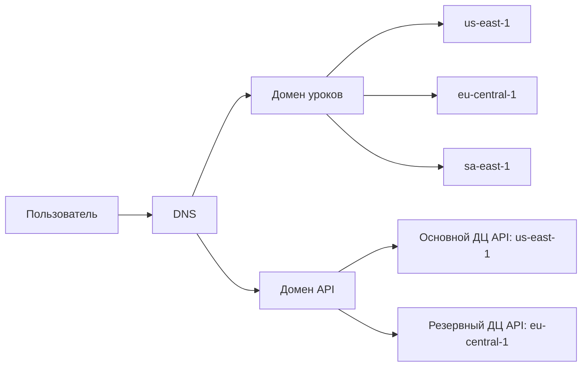
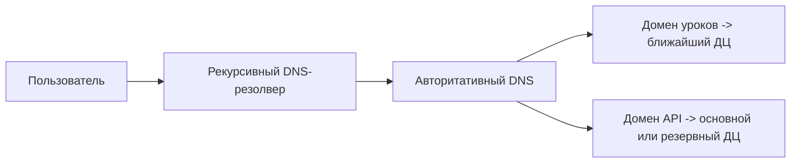
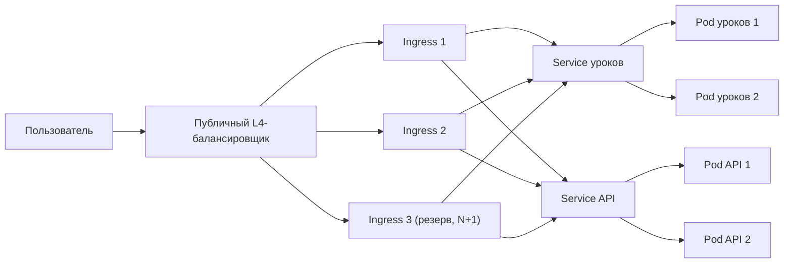
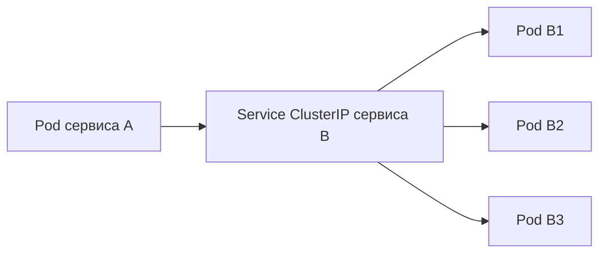
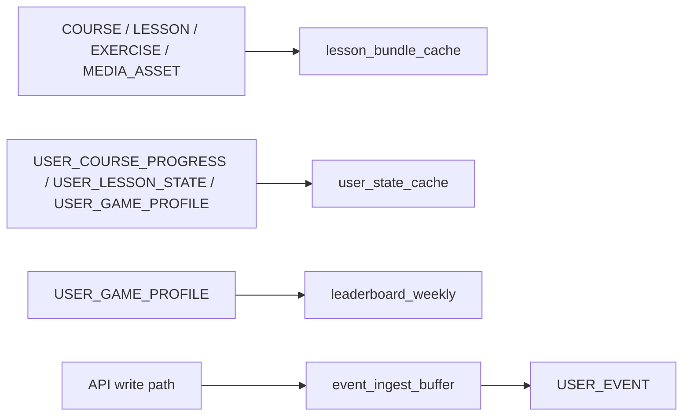
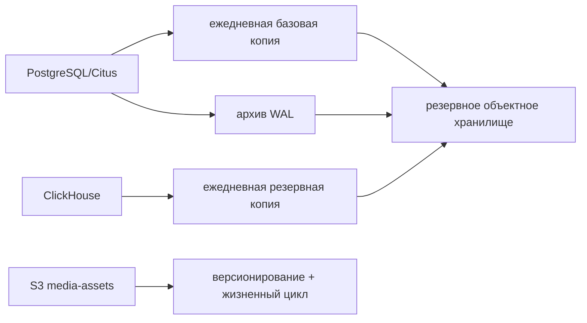
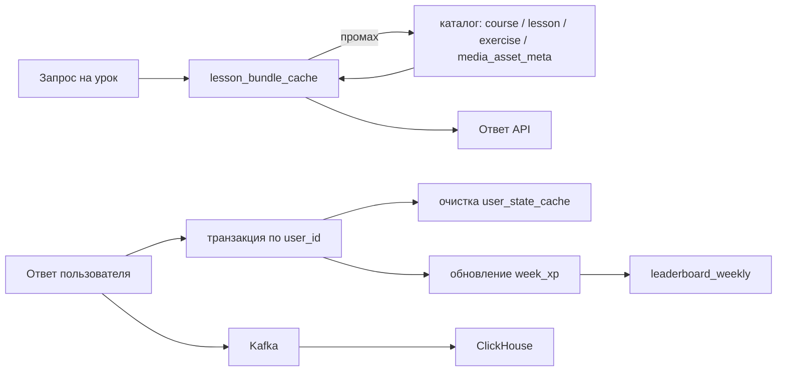

# 1. Расчетно-пояснительная записка

## Сервис для изучения иностранных языков

### Описание и аналоги

#### Описание

Сервис для изучения иностранных языков - онлайн мобильное приложение, позволяющий по коротким интерктивным урокам с персонализацией и геймифокицией поддерживать регулярное и постоянное изучение иностранных языков.

#### Аналоги

Существует несколько больших аналогов: Duolingo, Babbel, Memrise.

### Ключевые особенности 

- короткие сессии 2-5 минут
- "submit answer" - частые записи ответов
- большие пиковые нагрузки (утро/вечер)

### Аудитория 

Основная аудитория проектируемого сервиса -  пользователи в возрасте 20-45 лет, где основная масса попадет в возраст 25-34 лет. Объем аудитории - ~130 млн пользователей в месяц. Это значение соответствует аналогичному сервису Duolingo по количеству пользователей в месяц на мировом рынке ([1](#список-источников), [2](#список-источников), [3](#список-источников)).

### Функциональные требования

- Регистрация пользователя, выбор языка
- Персонализация контента под пользователя
- Прохождение уроков 
- Прогресс пользователя
- Проверка отетов и начисление наград
- Лидерборды (недельные рейтинги)

### Ключевые продуктовые решения

- Геймификация процесса обучения: каждое действие - event (ответ, завершение урока, стрик решений и тд)
- Персонализация обучения: рекомендации по повторению "западющих" тем
- Короткие сессии обучения (2-5 минут)

# 2. Расчет нагрузки

## Продуктовые метрики 

| Метрика                                         | Значение                     | Комментарии                                                  |
| ----------------------------------------------- | :--------------------------- | ------------------------------------------------------------ |
| MAU                                             | ~130,000,000 человек в месяц | Источник [[2](#список-источников)]                           |
| DAU                                             | ~50,500,000 человек в день   | Источник [[2](#список-источников)]                           |
| Средний размер хранилища пользователя в шт.     | 1                            | [Расчет среднего размера хранилища пользователя](#Расчет среднего размера хранилища пользователя) |
| Средний размер хранилища пользователя в Гб      | ~0.6 Кб                      | [Расчет среднего размера хранилища пользователя](#Расчет среднего размера хранилища пользователя) |
| Среднее количество действий пользователя в день | 77                           | [Расчет среднего количества действий пользователя в день](#Расчет среднего количества действий пользователя в день) |

####	Расчет среднего размера хранилища пользователя

Для каждого пользователя, в основном, сохраняется его прогресс и текущее состояние.

| Тип хранимых данных                    | Среднее количество | Оценка размера записи | Объем хранилища |
| -------------------------------------- | ------------------ | --------------------- | --------------- |
| Профиль пользователя                   | 1                  | 256 байт              | 256 байт        |
| Прогресс по курсу                      | 1                  | 160 байт              | 160 байт        |
| Состояние (текущая позиция)            | 1                  | 64 байт               | 64 байт         |
| Игровой профиль (XP/streak)            | 1                  | 64 байт               | 64 байт         |
| Пользовательские настройки и reminders | 1                  | 64 байт               | 64 байт         |
| Все данные                             | 5                  | -                     | 608 байт        |

### Расчет среднего количества действий пользователя в день

Точного количетсва действий пользователя в день не удалось найти из официальных источников. Но мы можем прикинуть среднее количество уроков и среднее время сессий пользователей в день. 

Из официального исчтоника [4](#список-источников) видно, что в среднем пользователь проводит около 15 минут сессий в день, что соответствует 3 сложным или 5 простым урокам. Тогда можно взять среднее количество уроков для каждого пользователя:
$$
Lessons_{avg} = \frac{3 + 5}{2} = 4
$$
Каждый урок включает в себя несколько действий:

* открытие lesson / path — 1 действие

* запуск lesson — 1 действие

* завершение lesson — 1 действие

* обновление прогресса, XP и streak — 1 действие
* прохождение урока (в среднем урок содержит 10-20 вопросов (по личному опыту). возьмем усредненное значение) - 15 действий

Тогда получается, что каждый урок в среднем занимает порядка 19 действий:
$$
Action_{lesson} = 19
$$

Также учтем одно дополнительное действие в день (например открытие личного профиля или leaderboard)
$$
Action_{extra} = 1
$$

Тогда среднее количетсво действий пользователя в день:
$$
Actions_{day} = Lessons_{avg} * Action_{lesson} + Action_{extra} = 4 * 19 + 1 = 77
$$

## Технические метрики

### Размер хранения

Для нашего сервиса необходимо учитывать три крупных класса данных:

* Пользовательские данные - профиль, прогресс, XP, streak, настройки
* Каталог контента - сами курсы, тексты уроков, JSON-структуры упражнений, изображения, аудио
* Операционные логи - отправка ответов пользователя

#### Принятые оценки

| Параметр                                         | Значение | Основание                                                    |
| ------------------------------------------------ | -------- | ------------------------------------------------------------ |
| Количество курсов                                | 280+     | Официальный Duolingo Language Report 2025 [[5](#список-источников)] |
| Количество аудиофайлов                           | 200+     | Официальный запуск Music [[5](#список-источников)]           |
| Пользователей в месяц                            | 130 млн  | Принято в расчётах выше                                      |
| Ответов на пользователя в день                   | 60       | Из расчёта `4 урока × 15 ответов`                            |
| Старта и завершений урока на пользователя в день | 8        | Из расчёта выше                                              |
| Размер одного события                            | 128 байт | [Инженерное допущение для MVP](#оценка размера хранения событий) |
| Retention raw events                             | 30 дней  | Инженерное допущение для MVP                                 |

#### Итоговая таблица

| Параметр                       | Значение     | Основание                                                    |
| ------------------------------ | ------------ | ------------------------------------------------------------ |
| Хранение данных пользователей  | 79.04 Гб     | [Расчет пользовательского состояния](#Расчет пользовательского состояния) |
| Хранение информации об уроках  | 28 Гб        | [Расчет каталога уроков](#Расчет каталога уроков)            |
| Хранение событий               | 14.93 Тб     | [Оценка размера хранения событий](#Оценка размера хранения событий) |
| Пиковое потребление            | 16.38 Гбит/c | [Трафик пользователей за сутки](#Трафик пользователей за сутки) |
| Среднее потребление            | 6.552 Гбит/с | [Трафик пользователей за сутки](#Трафик пользователей за сутки) |
| Суммарное суточное потребление | 70769 ГБ     | [Трафик пользователей за сутки](#Трафик пользователей за сутки) |

#### Расчет пользовательского состояния

$$
Storage_{user} = 130.000.000 * 608 байт = 79.04 Гб
$$

#### Расчет каталога уроков

##### Оценка размера курса

В официальных источниках не публикуется информация о размерах метаданных для одного курса. Поэтому проведем среднюю оценку размера одного курса:

Размер курса оцениваем через декомпозицию на уроки и упражнения.
В среднем курс содержит ~200 уроков. Один урок включает ~15 упражнений.

Для каждого упражнения:

- текстовые данные ≈ 300 байт
- аудио ≈ 2 секунды при 16 kbps → ~4 КБ
- часть упражнений сопровождается изображениями (~3 на урок, ~100 КБ каждое)

Тогда:
$$
Size_{lesson} ≈ 4.5 Кб (текст) + 300 Кб(изображения) + 60 Кб (аудио) ≈ 365 КБ
$$

$$
Size_{course} ≈ 200 × 365 КБ ≈ 71 МБ
$$

С учетом служебных данных и overhead:
$$
Size_{course} ≈ 90–100 МБ
$$

$$
Storage_{lessons} = 280 курсов * 100 Мбайт = 28 Гб
$$

#### Оценка размера хранения событий

Для расчета хранения событий выделим следующие типы в соответствие с MVP:

* Submit answer - фиксируем ответы пользователя
* Start lesson - фиксируем время прохождения и факт начала урока
* Lesson complete - фиксируем время и факт окончания урока

Ранее рассчитывали среднее количество действий пользователя в сутки:
$$
Actions_{day} = Lessons_{avg} * Action_{lesson} + Action_{extra} = 4 * 19 + 1 = 77
$$
Тогда количество событий в день:
$$
Events\_Per\_Day = DAU * 77 = 50.500.000 * 77 = 3.888.500.000
$$
Оценим средний размер события в 128 байт (к сожалению, найти точный размер не удается из официальных источников). Этот размер события позволит сохранить все необходимые метаданные о событие. Значение берется усредненное т.к. событие отправки ответа может занимать чуть больше места, но события по типу старт/окончания урока явно будут занимать меньше места.

Тогда общее необходимое место на 30 дневное хранение событий займет:
$$
Storage_{events} = Events\_Per\_Day * Size_{event} * Retention\_Row\_Events
$$

$$
Storage_{events} = 3.888.500.000 * 128 байт * 30 = 14.93 Тб
$$

### Сетевой трафик

Для проектируемого сервиса основной сетевой трафик формируется из двух крупных типов:

* Закгрузка уроков - текст урока, изображения и аудио;
* API-события - отправка ответов, старт/окончание урока.

#### Трафик пользователей за сутки

Закгрузка контента урока:
$$
Trffic\_lesson = Lessons_{avg} * Size_{lesson} = 4 * 365 КБ = 1460 КБ
$$
Трафик от пользовательских событий:
$$
Traffic\_Events = Actions_{day} * Size_{event} = 77 *128байт = 9.5 КБ
$$
Тогда трафик на одного пользователя:
$$
Traffic\_User = 1460КБ + 9.5КБ = 1.435 МБ
$$
Подсчитаем в Гбит/с для всех пользователей. Для пикового значения потребления возьмем типовой коэффициент 2.5
$$
Traffic\_Total = DAU * Traffic\_User = 50.500.000 * 1.435 МБ = 70769 ГБ = 566152 Гбит
$$

$$
Traffic_{avg} = \frac{Traffic\_Total}{86400 секунд} = \frac{566152 Гбит}{86400 секунд} = 6.552 Гбит/с
$$

$$
Traffic_{peak} = Traffic_{avg} * 2.5 = 6.552 Гбит * 2.5 = 16.38 Гбит/с
$$

| Пиковое потребление | Среднее потребление | Суммарное суточное потребление |
| :-----------------: | :-----------------: | :----------------------------: |
|    16.38 Гбит/c     |    6.552 Гбит/с     |            70769 ГБ            |

#### RPS

На основе ранее рассчитаного среднесуточного количества действий пользователя 

| Загрузка урока | Старт урока | Окончание урока | Отправка ответов |
| :------------: | :---------: | :-------------: | :--------------: |
|       4        |      4      |        4        |        15        |

$$
RPS_i = \frac{DAU * Request_i}{86400 секунд}
$$

|     Действие     | RPS в среднем | RPS пиковы | Запросов в сутки |
| :--------------: | :-----------: | :--------: | :--------------: |
|  Загрузка урока  |     2338      |    5845    |    202.000.00    |
|   Старт урока    |     2338      |    5845    |    202.000.00    |
| Окончание урока  |     2338      |    5845    |    202.000.00    |
| Отправка ответов |     8767      |   21918    |   757.500.000    |
|      Всего       |     15781     |   39453    |  1.363.700.000   |

# 3. Глобальная балансировка нагрузки

По Similarweb [3](#Список источников) среди раскрытых стран трафик duolingo распределен как минимум между несколькими регионами:

* США и Канада — `32.47%`;
* Бразилия — `6.80%`;
* Германия и Великобритания — `7.50%`;
* остальные страны — `53.23%`.

В рамках проектирования нашего сервиса будем опираться на статистику распределения трафика Duolingo.

Поэтому для глобальной конфигурации выбираем три ДЦ:

* `us-east-1` — основной ДЦ;
* `eu-central-1` — европейский ДЦ;
* `sa-east-1` — южноамериканский ДЦ.

Основная часть сетевого трафика приходится на выдачу уроков, а каталог уроков занимает всего `28 ГБ`, поэтому его можно реплицировать между несколькими ДЦ. Напротив, пользовательское состояние и события чувствительны к консистентности, поэтому их запись целесообразно оставить в одном основном ДЦ и переключать в резерв только при аварии.

## Разделение трафика

Выделим две основные группы трафика:

* выдача уроков: текст, изображения, аудио;
* API-запросы: старт урока, окончание урока, отправка ответов, обновление прогресса.

По расчетам из предыдущего раздела:

* выдача уроков: `1460 КБ` на пользователя в сутки;
* API-запросы: `9.5 КБ` на пользователя в сутки.

Следовательно:

* выдача уроков: `99.35%` трафика;
* API-запросы: `0.65%` трафика.

Значит, глобальная схема в первую очередь должна уменьшать задержку именно на доставке уроков. Для API важнее корректная запись прогресса, XP и серии дней, чем распределение записи по нескольким регионам в штатном режиме.

## Функциональное разбиение по доменам

Логически выделяются два домена:

* домен уроков — загрузка уроков и связанных медиафайлов;
* домен API — пользовательские события и текущее состояние.

Такое разбиение позволяет использовать разные схемы глобальной балансировки:

* для домена уроков — распределение между ДЦ по задержке;
* для домена API — схема основной/резервный ДЦ.

## Схема глобальной балансировки

Для домена уроков трафик направляется в ближайший ДЦ. Для домена API в штатном режиме весь трафик идет в основной ДЦ, а при аварии переключается в резервный.

Подобная схема позволит убрать единую точку отказа для продукта и позволяет вынести самый тяжелый трафик ближе к пользователю.

## Распределение запросов по ДЦ

### Домен уроков

Для загрузки уроков сначала используем раскрытые доли из Similarweb [3](#Список источников):

* США + Канада — `32.47%`;
* Бразилия — `6.80%`;
* Германия + Великобритания — `7.50%`;
* Остальной мир — `53.23%`.

Распределим `Остальной мир` между тремя основными ДЦ пропорционально уже известным долям регионов. Тогда итоговое распределение запросов на загрузку уроков будет следующим:
$$
RPS_{dc} = RPS_{lesson} * Share_{dc}
$$

| ДЦ             | Доля трафика | Средний RPS | Пиковый RPS |
| -------------- | ------------ | ----------- | ----------- |
| `us-east-1`    | 69.42%       | 1623        | 4058        |
| `eu-central-1` | 16.04%       | 375         | 937         |
| `sa-east-1`    | 14.54%       | 340         | 850         |

### Домен API

Для домена API в штатном режиме весь трафик идет в основной ДЦ. При аварии выполняется переключение на резервный ДЦ.

| Тип запроса      | Средний RPS | Пиковый RPS | Распределение                               |
| ---------------- | ----------- | ----------- | ------------------------------------------- |
| Старт урока      | 2338        | 5845        | 100% `us-east-1`, при сбое — `eu-central-1` |
| Окончание урока  | 2338        | 5845        | 100% `us-east-1`, при сбое — `eu-central-1` |
| Отправка ответов | 8767        | 21918       | 100% `us-east-1`, при сбое — `eu-central-1` |
| Всего            | 13443       | 33608       | 100% `us-east-1`, при сбое — `eu-central-1` |

## Схема DNS-балансировки

DNS используется как глобальная точка входа. Для домена уроков применяется маршрутизация по задержке между тремя ДЦ [7](#Список источников). Для домена API используется схема основной/резервный ДЦ с проверкой доступности [8](#Список источников). 

## Схема Anycast-балансировки

Anycast в данной схеме не используется. Anycast имеет смысл, когда один и тот же сервис публикуется из нескольких независимых точек. В текущем MVP задача глобальной балансировки решается на DNS-уровне.

## Регулировка трафика между ДЦ

Регулировка трафика между ДЦ выполняется на DNS-уровне:

* для домена уроков — через маршрутизацию по задержке между `us-east-1`, `eu-central-1` и `sa-east-1`;
* для домена API — через переключение с `us-east-1` на `eu-central-1` при недоступности основного ДЦ.

# 4. Локальная балансировка нагрузки

Для каждого ДЦ принимаем одинаковую схему:

* входящие запросы: публичный `L4`-балансировщик -> `NGINX Ingress` -> `Service` -> `Pod`;
* межсервисные запросы: `Service ClusterIP` -> `Pod`.

На внешнем входе `NGINX` выполняет терминацию `SSL/TLS` и маршрутизацию по доменам [14]. Для домена уроков используем `round-robin`, для домена API — `least_conn` [15].

## Схема входящих запросов

## Схема межсервисных запросов

## Отказоустойчивость

Для локальной балансировки выбираем резервирование по формуле `N+1`.

* публичный `L4`-балансировщик — управляемый сервис облака;
* `NGINX Ingress` — несколько реплик по схеме `N+1`;
* сервисы приложения — минимум в двух репликах;
* трафик направляется только на готовые экземпляры сервиса [13].

## Расчет нагрузки по терминации SSL

`SSL TPS` — это число новых `HTTPS`-соединений в секунду [11], [12].  
Для оценки берем `keepalive_requests = 100` [16], тогда:

$$
SSL\ TPS_{dc} = \frac{RPS_{peak,dc}}{100}
$$

По `SSL/TLS`:

$$
N_{ssl} = \left\lceil \frac{SSL\ TPS_{dc}}{10274} \right\rceil
$$

Здесь `10274 CPS` — результат из бенчмарка `NGINX 2017` [12].

По сети:

$$
N_{net} = \left\lceil \frac{Traffic_{peak,dc}}{8.80} \right\rceil
$$

Здесь `8.80 Гбит/с` — результат из бенчмарка `NGINX Ingress 2019` [11].

Итоговая формула:

$$
N = \max(N_{ssl}, N_{net}), \quad N_{final} = N + 1
$$

| ДЦ             | Пиковый `RPS` | Пиковый трафик, Гбит/с | `SSL TPS` | `N_ssl` | `N_net` | `N`  | `N+1` |
| -------------- | ------------- | ---------------------- | --------- | ------- | ------- | ---- | ----- |
| `us-east-1`    | 37666         | 11.404                 | 377       | 1       | 2       | 2    | 3     |
| `eu-central-1` | 937           | 2.610                  | 10        | 1       | 1       | 1    | 2     |
| `sa-east-1`    | 850           | 2.366                  | 9         | 1       | 1       | 1    | 2     |

Итого:

* `us-east-1` — `3` балансировщика;
* `eu-central-1` — `2` балансировщика;
* `sa-east-1` — `2` балансировщика.

Всего по системе: `7` входных балансировщиков. Ограничение здесь задает сеть, а не терминация `SSL/TLS`.

# 5. Логическая схема БД

## Логическая схема данных

Дополнительно учитываем логические кеши и буферы:

Этого набора данных достаточно для основных API:

* регистрация, логин, профиль — `USER_ACCOUNT`, `USER_SETTINGS`;
* загрузка урока — `COURSE`, `LESSON`, `EXERCISE`, `MEDIA_ASSET`, `USER_COURSE_PROGRESS`, `USER_LESSON_STATE`;
* старт урока, отправка ответа, завершение урока — `USER_LESSON_STATE`, `USER_COURSE_PROGRESS`, `USER_GAME_PROFILE`, `USER_EVENT`;
* лидерборды — `USER_GAME_PROFILE` и `leaderboard_weekly`;
* персонализация и повторение тем — `USER_COURSE_PROGRESS`;
* напоминания — `USER_SETTINGS`.

## Описание таблиц

| Таблица                | Назначение                                    | Ключ          | Основные поля                                                |
| ---------------------- | --------------------------------------------- | ------------- | ------------------------------------------------------------ |
| `USER_ACCOUNT`         | учетная запись и базовый профиль пользователя | `user_id`     | `email`, `password_hash`, `base_language`, `target_language`, `status` |
| `USER_SETTINGS`        | настройки пользователя и напоминания          | `user_id`     | `reminder_enabled`, `reminder_time`, `timezone`, `app_language` |
| `USER_COURSE_PROGRESS` | текущий прогресс по активному курсу           | `user_id`     | `course_id`, `current_lesson_id`, `completed_lessons`, `weak_topics` |
| `USER_LESSON_STATE`    | состояние текущего урока                      | `user_id`     | `lesson_id`, `exercise_index`, `state_payload`               |
| `USER_GAME_PROFILE`    | игровые метрики и данные для лидерборда       | `user_id`     | `xp_total`, `week_xp`, `streak_days`, `league_id`            |
| `COURSE`               | метаданные курса                              | `course_id`   | `base_language`, `target_language`, `title`, `version`       |
| `LESSON`               | урок в составе курса                          | `lesson_id`   | `course_id`, `order_no`, `title`, `version`                  |
| `EXERCISE`             | упражнение внутри урока                       | `exercise_id` | `lesson_id`, `order_no`, `exercise_type`, `payload_ref`      |
| `MEDIA_ASSET`          | файловые данные: аудио и изображения          | `asset_id`    | `lesson_id`, `exercise_id`, `asset_type`, `size_bytes`, `storage_key` |
| `USER_EVENT`           | сырой журнал событий пользователя             | `event_id`    | `user_id`, `lesson_id`, `event_type`, `payload`, `created_at` |

## Размер данных и нагрузка

### Устойчивые данные

| Сущность               | Размер данных                                   | Чтение, `QPS avg/peak` | Запись, `QPS avg/peak` | Консистентность                                            | Комментарий                                                  |
| ---------------------- | ----------------------------------------------- | ---------------------- | ---------------------- | ---------------------------------------------------------- | ------------------------------------------------------------ |
| `USER_ACCOUNT`         | `130 млн × 256 Б = 33.28 ГБ`                    | вне горячего пути      | вне горячего пути      | сильная                                                    | ключ `user_id`, равномерная нагрузка                         |
| `USER_SETTINGS`        | `130 млн × 64 Б = 8.32 ГБ`                      | вне горячего пути      | вне горячего пути      | сильная                                                    | ключ `user_id`, равномерная нагрузка                         |
| `USER_COURSE_PROGRESS` | `130 млн × 160 Б = 20.8 ГБ`                     | `2338 / 5845`          | `2338 / 5845`          | сильная                                                    | чтение при загрузке урока, запись при завершении урока       |
| `USER_LESSON_STATE`    | `130 млн × 64 Б = 8.32 ГБ`                      | `11105 / 27763`        | `13443 / 33608`        | сильная                                                    | чтение при загрузке урока и отправке ответа, запись при старте урока, ответе и завершении |
| `USER_GAME_PROFILE`    | `130 млн × 64 Б = 8.32 ГБ`                      | вне горячего пути      | `2338 / 5845`          | сильная                                                    | лидерборд читается через кеш, запись идет при завершении урока |
| `COURSE`               | `280 × 4 КБ = 1.12 МБ`                          | до `2338 / 5845`       | публикация             | чтение после публикации                                    | верхняя оценка при полном промахе `lesson_bundle_cache`      |
| `LESSON`               | `56 000 × 1 КБ = 56 МБ`                         | до `2338 / 5845`       | публикация             | чтение после публикации                                    | верхняя оценка при полном промахе `lesson_bundle_cache`      |
| `EXERCISE`             | `840 000 × 300 Б = 252 МБ`                      | до `35070 / 87675`     | публикация             | чтение после публикации                                    | `15` упражнений на урок, верхняя оценка при полном промахе `lesson_bundle_cache` |
| `MEDIA_ASSET`          | `1 008 000 объектов = 27.69 ГБ`                 | до `42084 / 105210`    | публикация             | чтение после публикации                                    | файловые данные урока, верхняя оценка при полном промахе `lesson_bundle_cache` |
| `USER_EVENT`           | `3.8885 млрд/день × 30 дней × 128 Б = 14.93 ТБ` | вне горячего пути      | `45006 / 112514`       | допустима отложенная согласованность после записи в журнал | поток равномерен по `user_id`, пик по времени суток          |

### Кеши и буферы

| Сущность              | Размер данных                                                | Чтение, `QPS avg/peak` | Запись, `QPS avg/peak`   | Консистентность                                     | Комментарий                                          |
| --------------------- | ------------------------------------------------------------ | ---------------------- | ------------------------ | --------------------------------------------------- | ---------------------------------------------------- |
| `lesson_bundle_cache` | `56 000 × 365 КБ = 20.44 ГБ`                                 | `2338 / 5845`          | по публикации и прогреву | отложенная согласованность, `TTL`                   | готовый пакет урока для API загрузки урока           |
| `user_state_cache`    | `50.5 млн × 608 Б = 30.70 ГБ`                                | до `15781 / 39453`     | `13443 / 33608`          | отложенная согласованность, инвалидация по ключу    | агрегированное состояние пользователя в горячем пути |
| `event_ingest_buffer` | `112 514 × 128 Б × T_flush = 14.4 МБ × T_flush(сек)` на пике | `45006 / 112514`       | `45006 / 112514`         | отложенная согласованность до сброса в `USER_EVENT` | буферизация пикового потока событий                  |

Отдельно не оцениваем размер `leaderboard_weekly`, так как в текущих предположениях отчета не задан размер лиги и число участников недельного рейтинга. Без нового допущения этот кеш можно описать только качественно: горячий ключ — `league_id + week_id`, запись идет при обновлении `week_xp`, чтение — при открытии лидерборда.

## Замечания по консистентности и ключам

* сильная консистентность нужна для `USER_ACCOUNT`, `USER_SETTINGS`, `USER_COURSE_PROGRESS`, `USER_LESSON_STATE`, `USER_GAME_PROFILE`, так как эти данные сразу влияют на ответ API;
* для контентных таблиц достаточно чтения после публикации: после публикации новая версия урока должна читаться консистентно, но пользовательские записи они не блокируют;
* для `USER_EVENT`, кешей и буфера допустима eventual-консистентность, так как это либо журнал, либо производные структуры;
* основное смещение чтения идет по `lesson_id` и `course_id`: стартовые уроки и популярные языки читаются заметно чаще остальных;
* основное смещение записи идет по `user_id` в таблицах состояния: нагрузка распределена широко, но горячими становятся пользователи с активной сессией;
* для лидербордов горячим ключом становится комбинация `league_id + week_id`, поэтому читать такие данные лучше через кэш, а не напрямую из основного состояния пользователя.

# 6. Физическая схема БД

На физическом уровне данные делим на четыре контура:

* транзакционные пользовательские данные;
* каталог уроков и метаданные медиа;
* кеши и производные структуры;
* поток событий и аналитический журнал.

Это соответствует нашей нагрузке из предыдущих разделов: пользовательский контур дает до `45 298` записей/с на пике, а журнал событий — до `112 514` событий/с и `14.93 ТБ` за `30` дней. Поэтому использовать одно хранилище для всех типов данных нецелесообразно.

## Физическая схема

На схеме ниже используется та же логическая модель, что и в разделе 5, но над каждой группой таблиц отмечено целевое хранилище.

## Выбор СУБД по таблицам

Для пользовательского контура выбираем `PostgreSQL + Citus`. В Citus есть локальные таблицы координатора, распределенные таблицы и справочные таблицы в одном кластере. Распределение идет по выбранному ключу, а справочные таблицы реплицируются на каждый рабочий узел [17], [18]. Для нашего случая это удобно:

* `user_account`, `user_settings` — локальные таблицы координатора, так как у них низкая нагрузка и нужен глобальный `UNIQUE(email)`;
* `user_course_progress`, `user_lesson_state`, `user_game_profile` — распределенные таблицы по `user_id`;
* `course`, `lesson`, `exercise`, `media_asset_meta` — справочные таблицы, так как они небольшие и часто читаются вместе с пользовательскими данными.

Для файловых данных выбираем `S3`. В базе храним только метаданные медиа, а сами аудио и изображения лежат в объектном хранилище. Для восстановления старых версий включаем версионирование [29].

Для кешей выбираем `Redis Cluster`:

* `lesson_bundle_cache` — денормализованный пакет урока;
* `user_state_cache` — агрегированное состояние пользователя;
* `leaderboard_weekly` — денормализованный недельный лидерборд по лиге.

Для буфера событий выбираем `Kafka`: журнал делится на партиции, а каждая партиция реплицируется с заданным фактором репликации [25].

Для долгого хранения и аналитики событий выбираем `ClickHouse`. Для локального хранения на шардах используем `ReplicatedMergeTree`, а для общей точки чтения — `Distributed` [26], [27].

## Описание физических таблиц и структур

| Логическая сущность    | Хранилище                 | Физическая таблица / ключ                   | Индексы и денормализация                                     | Шардирование и резерв                                        | Интеграция                            |
| ---------------------- | ------------------------- | ------------------------------------------- | ------------------------------------------------------------ | ------------------------------------------------------------ | ------------------------------------- |
| `USER_ACCOUNT`         | `PostgreSQL/Citus`        | `user_account`, ключ `user_id`              | `PK(user_id)`, `UNIQUE(email)`                               | локальная таблица на координаторе, `1` основной + `2` резервных | драйвер PostgreSQL через `PgBouncer`  |
| `USER_SETTINGS`        | `PostgreSQL/Citus`        | `user_settings`, ключ `user_id`             | `PK(user_id)`                                                | локальная таблица на координаторе, `1` основной + `2` резервных | драйвер PostgreSQL через `PgBouncer`  |
| `USER_COURSE_PROGRESS` | `PostgreSQL/Citus`        | `user_course_progress`, ключ `user_id`      | только `PK(user_id)`                                         | `16` шардов по `hash(user_id)`, `RF=2`                       | драйвер PostgreSQL через `PgBouncer`  |
| `USER_LESSON_STATE`    | `PostgreSQL/Citus`        | `user_lesson_state`, ключ `user_id`         | только `PK(user_id)`                                         | `16` шардов по `hash(user_id)`, `RF=2`                       | драйвер PostgreSQL через `PgBouncer`  |
| `USER_GAME_PROFILE`    | `PostgreSQL/Citus`        | `user_game_profile`, ключ `user_id`         | только `PK(user_id)`; недельный рейтинг вынесен в `Redis`    | `16` шардов по `hash(user_id)`, `RF=2`                       | драйвер PostgreSQL через `PgBouncer`  |
| `COURSE`               | `PostgreSQL/Citus`        | `course`, ключ `course_id`                  | `PK(course_id)`, `IDX(base_language, target_language)`       | справочная таблица, копия на каждом рабочем узле             | драйвер PostgreSQL через `PgBouncer`  |
| `LESSON`               | `PostgreSQL/Citus`        | `lesson`, ключ `lesson_id`                  | `PK(lesson_id)`, `IDX(course_id, order_no)`                  | справочная таблица, копия на каждом рабочем узле             | драйвер PostgreSQL через `PgBouncer`  |
| `EXERCISE`             | `PostgreSQL/Citus`        | `exercise`, ключ `exercise_id`              | `PK(exercise_id)`, `IDX(lesson_id, order_no)`                | справочная таблица, копия на каждом рабочем узле             | драйвер PostgreSQL через `PgBouncer`  |
| `MEDIA_ASSET`          | `PostgreSQL/Citus` + `S3` | `media_asset_meta` + объект в `S3`          | `PK(asset_id)`, `IDX(lesson_id)`, `IDX(exercise_id)`         | метаданные — справочная таблица; файлы — версионирование в `S3` | драйвер PostgreSQL + `AWS SDK`        |
| `lesson_bundle_cache`  | `Redis Cluster`           | `lesson_bundle_cache:{lesson_id}:{version}` | хранит уже собранный урок целиком                            | `16384` слота, `3` мастера + `3` реплики                     | клиент Redis Cluster                  |
| `user_state_cache`     | `Redis Cluster`           | `user_state_cache:{user_id}`                | хранит агрегированное состояние пользователя                 | `16384` слота, `3` мастера + `3` реплики                     | клиент Redis Cluster                  |
| `leaderboard_weekly`   | `Redis Cluster`           | `leaderboard_weekly:{league_id}:{week_id}`  | отсортированное множество по `week_xp`                       | `16384` слота, `3` мастера + `3` реплики                     | клиент Redis Cluster                  |
| `event_ingest_buffer`  | `Kafka`                   | `user_event_raw`, ключ `user_id`            | порядок сохраняется внутри партиции                          | `48` партиций, `RF=3`                                        | клиент записи / клиент чтения         |
| `USER_EVENT`           | `ClickHouse`              | `user_event_local` + `user_event`           | `PARTITION BY toYYYYMMDD(created_at)`, `ORDER BY (user_id, created_at)` | `3` шарда по `2` реплики                                     | нативный или `HTTP` клиент ClickHouse |

## Индексы и денормализация

В горячем пользовательском контуре вторичные индексы стараемся не добавлять: там важнее дешевые записи по `user_id`, чем сложные выборки. Поэтому:

* в `user_account` оставляем `PK(user_id)` и `UNIQUE(email)`;
* в `user_settings`, `user_course_progress`, `user_lesson_state`, `user_game_profile` оставляем только `PK(user_id)`;
* вторичные индексы выносим в основном на каталог: `course`, `lesson`, `exercise`, `media_asset_meta`.

Денормализация нужна в трех местах:

* `lesson_bundle_cache` хранит уже собранный урок целиком, чтобы не собирать его из `course + lesson + exercise + media_asset_meta` на каждый запрос;
* `user_state_cache` хранит агрегированное состояние пользователя;
* `leaderboard_weekly` хранит уже отсортированный недельный рейтинг по `league_id + week_id`.

## Шардирование, резервирование и надежность

### PostgreSQL / Citus

В Citus распределение идет по выбранному ключу, а справочные таблицы реплицируются на каждый рабочий узел [17], [18]. Поэтому горячие пользовательские таблицы распределяем по `user_id`, а каталог оставляем справочным.

Пиковая запись в пользовательский контур:

$$
QPS_{user\_write} = 33608 + 5845 + 5845 = 45298
$$

При `16` шардах:

$$
QPS_{shard} = \frac{45298}{16} \approx 2831
$$

То есть на один шард приходится около `2.8 тыс.` записей/с на пике. Для `PostgreSQL` это уже заметно проще, чем держать весь поток на одном узле.

Резервирование:

* локальные таблицы координатора: `1` основной + `2` резервных;
* распределенные таблицы: `RF=2`;
* справочные таблицы автоматически доступны на каждом рабочем узле [17], [18].

Для резервных узлов `PostgreSQL` можно использовать потоковую репликацию, а в режиме `Hot Standby` они могут принимать запросы только на чтение [20], [21].

### Redis Cluster

По документации `Redis Cluster` пространство ключей делится на `16384` слота, а реплика может заменить недоступный мастер [23]. Для нашего случая этого достаточно:

* `lesson_bundle_cache`, `user_state_cache`, `leaderboard_weekly` распределяются по слотам;
* при отказе мастера используется реплика;
* сами данные в `Redis` являются производными, поэтому это не единственная точка хранения.

### Kafka

Для `user_event_raw` берем `48` партиций и `RF=3`. В `Kafka` именно партиция является единицей репликации, а порядок сообщений сохраняется внутри одной партиции [25]. При пиковом потоке событий:

$$
QPS_{event\_peak} = 112514
$$

нагрузка на одну партицию:

$$
QPS_{partition} = \frac{112514}{48} \approx 2344
$$

Это дает около `2.3 тыс.` сообщений/с на одну партицию, что выглядит безопасно для буферизации горячего потока.

### ClickHouse

В `ClickHouse` репликация не зависит от шардирования, а для `ReplicatedMergeTree` рекомендуется писать не одиночными вставками, а батчами [26]. Поэтому:

* события сначала попадают в `Kafka`;
* из `Kafka` они читаются батчами и пишутся в `user_event_local`;
* для аналитики используется `user_event` на `Distributed` engine [27].

При `3` шардах:

$$
Rows_{shard} = \frac{112514}{3} \approx 37505 \text{ строк/с}
$$

Это около `37.5 тыс.` строк/с на один шард. Для аналитического контура такая схема выглядит реалистично.

### S3

Файловые данные выносим в `S3`, так как они не требуют транзакционных соединений с пользовательским состоянием. Версионирование в `S3` позволяет хранить несколько версий одного объекта и восстанавливаться после удаления или перезаписи [29].

## Клиентские библиотеки / интеграции

* `PostgreSQL/Citus` — обычный драйвер PostgreSQL;
* `PgBouncer` — пул соединений перед `PostgreSQL/Citus`;
* `Redis Cluster` — клиент с поддержкой слотов кластера;
* `Kafka` — клиент записи в `API` и клиент чтения в сервисе записи событий;
* `ClickHouse` — нативный или `HTTP` клиент;
* `S3` — `AWS SDK` и подписанные ссылки на чтение объектов.

## Балансировка запросов и мультиплексирование подключений

Для `PostgreSQL/Citus` используем `PgBouncer`. Он поддерживает пул на уровне транзакций: соединение с сервером выдается клиенту только на время транзакции, а потом возвращается в пул [22]. Для коротких запросов `API` это подходит хорошо.

Схема работы:

* `API -> PgBouncer -> Citus coordinator`;
* координатор маршрутизирует запросы к локальным, распределенным и справочным таблицам;
* чтение по кешам идет напрямую в `Redis Cluster`;
* запись событий идет `API -> Kafka`, без прямого подключения `API` к `ClickHouse`.

Это уменьшает число постоянных подключений к основной реляционной базе и упрощает работу внешнего `API`.

## Схема резервного копирования

* `PostgreSQL/Citus`: ежедневная базовая резервная копия + архивирование `WAL`, восстановление через `PITR` на `30` дней [19], [20];
* `Redis`: полноценная резервная копия не обязательна, так как данные производные; для ускорения прогрева достаточно `RDB snapshot` раз в час [24];
* `Kafka`: отдельное резервное копирование не делаем, надежность дает `RF=3`, а для повторного чтения оставляем хранение `72 часа`;
* `ClickHouse`: ежедневная резервная копия в объектное хранилище; сама репликация не заменяет резервные копии [28];
* `S3 media-assets`: включено версионирование, для старых версий можно включить политику жизненного цикла [29].

# 7. Алгоритмы

## Общее описание алгоритмов

В этом разделе описаны только те алгоритмы, которые реально влияют на архитектуру сервиса, схему данных и профиль нагрузки:

* формирование пакета урока;
* транзакционное обновление состояния пользователя;
* поддержка недельного лидерборда;
* асинхронная запись событий.

Именно эти блоки определяют, почему в проекте одновременно используются `PostgreSQL + Citus`, `Redis Cluster`, `Kafka`, `ClickHouse` и `S3`.

## Формирование пакета урока

**Блок.** Сервис уроков.

**Задача.** По `lesson_id` и версии урока отдать готовый пакет данных для прохождения урока с минимальным числом обращений к БД.

**Исходные данные и ограничения.** Домен уроков дает основной трафик сервиса: `2338 / 5845 RPS` на загрузку урока. Каталог уроков относительно небольшой (`28 ГБ`), но хранится в нормализованном виде: `course`, `lesson`, `exercise`, `media_asset_meta`. Для опубликованной версии урока достаточно консистентности вида "чтение после публикации".

**Последовательность работы.**

1. `API` получает `lesson_id` и версию урока.
2. Выполняется чтение из `lesson_bundle_cache:{lesson_id}:{version}`.
3. Если ключ найден, пакет урока сразу возвращается клиенту.
4. Если ключ не найден, сервис читает `course`, `lesson`, `exercise`, `media_asset_meta`.
5. Из полученных данных собирается один неизменяемый пакет урока.
6. Собранный пакет кладется в `lesson_bundle_cache` и возвращается клиенту.

**Структуры данных.** Нормализованный каталог в `PostgreSQL/Citus`, ключ `lesson_bundle_cache:{lesson_id}:{version}` в `Redis`, объект медиа в `S3`.

**Альтернативы.** Собирать урок на каждом запросе из нормализованных таблиц; хранить урок целиком как один документ в основной БД.

**Почему выбрано.** Сборка урока на каждом запросе дала бы повторяющиеся чтения и объединения таблиц в самом горячем домене. Хранение урока целиком только в документном виде упростило бы выдачу, но усложнило бы поддержку каталога. Поэтому авторитетный каталог оставляем нормализованным, а для горячего чтения используем денормализованный кеш. Это согласуется с тем, что в Citus справочные таблицы можно держать на каждом рабочем узле [17], [18].

**Влияние на систему.** Алгоритм объясняет появление `lesson_bundle_cache` в логической и физической схемах БД, снижает нагрузку на реляционную БД в домене уроков и переносит горячее чтение в `Redis`.

## Транзакционное обновление состояния пользователя

**Блок.** Сервис прогресса.

**Задача.** После ответа пользователя обновить текущее состояние урока, прогресс по курсу и игровой профиль так, чтобы пользователь сразу видел корректный результат.

**Исходные данные и ограничения.** Пользовательский контур требует сильной консистентности. Пиковая запись в этот контур составляет `45 298` записей/с. Все горячие пользовательские таблицы уже выбраны с ключом распределения `user_id`.

**Последовательность работы.**

1. `API` получает ответ пользователя.
2. Открывается транзакция в `PostgreSQL/Citus`.
3. Обновляется `user_lesson_state`.
4. Если урок завершен, обновляются `user_course_progress` и `user_game_profile`.
5. Транзакция фиксируется.
6. После фиксации удаляется ключ `user_state_cache:{user_id}`.

**Структуры данных.** Таблицы `user_lesson_state`, `user_course_progress`, `user_game_profile`, ключ `user_state_cache:{user_id}`.

**Альтернативы.** Выполнять несколько независимых `UPDATE`; хранить только сырые события, а состояние пользователя пересчитывать асинхронно.

**Почему выбрано.** Независимые `UPDATE` дают риск частично обновленного состояния. Полный пересчет из событий уменьшил бы требования к транзакциям, но пользователь не видел бы мгновенного обновления прогресса, `XP` и серии. В `PostgreSQL` транзакция объединяет несколько шагов в одну атомарную операцию [30]. В нашем случае это особенно удобно, потому что пользовательские таблицы распределены по `user_id`, а значит изменения одного пользователя попадают на один и тот же шард [17], [18].

**Влияние на систему.** Алгоритм объясняет выбор сильноконсистентного пользовательского контура в `PostgreSQL/Citus`, шардирование по `user_id` и отказ от лишних вторичных индексов в горячих таблицах. При `16` шардах получается около `2831` записей/с на шард, что уже соответствует расчетам из раздела 6.

## Поддержка недельного лидерборда

**Блок.** Игровой контур.

**Задача.** Быстро отдавать верхние `N` пользователей в лиге и место текущего пользователя в недельном рейтинге без сортировки всей таблицы на каждый запрос.

**Исходные данные и ограничения.** Лидерборд является вторичным по отношению к прогрессу пользователя, поэтому здесь допустима отложенная согласованность. Горячий ключ — комбинация `league_id + week_id`. Рейтинг должен быстро обновляться при изменении `XP`.

**Последовательность работы.**

1. После обновления `week_xp` в `user_game_profile` сервис получает новое значение недельного опыта.
2. В `Redis` обновляется ключ `leaderboard_weekly:{league_id}:{week_id}`.
3. Для чтения верхних `N` используется чтение по диапазону сверху.
4. Для чтения позиции пользователя используется запрос его ранга.
5. После завершения недели создается новый ключ с новым `week_id`, старый ключ удаляется по `TTL`.
6. При потере кеша рейтинг может быть восстановлен из `user_game_profile`.

**Структуры данных.** `user_game_profile` как авторитетный источник, `leaderboard_weekly:{league_id}:{week_id}` как отсортированное множество в `Redis`.

**Альтернативы.** Считать рейтинг SQL-запросом `ORDER BY week_xp` при каждом чтении; строить рейтинг напрямую из сырых событий в `ClickHouse`.

**Почему выбрано.** Считать рейтинг каждый раз в реляционной БД дорого для горячего ключа `league_id + week_id`. Строить рейтинг напрямую из событий тоже сложнее и добавляет лишнюю задержку. В `Redis` отсортированные множества подходят именно для сценария "обновить счет, получить диапазон лидеров и ранг пользователя" [31].

**Влияние на систему.** Алгоритм объясняет появление `leaderboard_weekly` в `Redis`, хранение `week_xp` в `user_game_profile` и вынос чтения рейтинга из основного пользовательского контура.

## Асинхронная запись событий

**Блок.** Контур событий и аналитики.

**Задача.** Сохранять все действия пользователя для аналитики и последующей обработки, не замедляя горячий `API`-путь.

**Исходные данные и ограничения.** Средняя запись событий составляет `45 006` событий/с, пиковая — `112 514` событий/с. Хранение сырых событий за `30` дней дает `14.93 ТБ`. Для аналитики важна полнота данных, а для пользовательского ответа допустима асинхронная доставка.

**Последовательность работы.**

1. `API` формирует событие и отправляет его в `Kafka` с ключом `user_id`.
2. `Kafka` распределяет события по `48` партициям.
3. Порядок событий одного пользователя сохраняется внутри его партиции [25].
4. Сервис-потребитель читает события батчами.
5. Батчи записываются в `ClickHouse` в `user_event_local`.
6. Аналитические запросы выполняются через распределенную таблицу `user_event`.

**Структуры данных.** Тема `user_event_raw` в `Kafka`, таблицы `user_event_local` и `user_event` в `ClickHouse`.

**Альтернативы.** Писать каждое событие синхронно в `PostgreSQL/Citus`; писать каждое событие напрямую из `API` в `ClickHouse`.

**Почему выбрано.** Синхронная запись каждого события в основную БД увеличила бы нагрузку на транзакционный контур. Прямая запись мелкими вставками в `ClickHouse` нежелательна: официальный материал ClickHouse прямо рекомендует избегать большого числа маленьких вставок и писать данные пакетами, иначе растет число частей и стоимость слияний [32]. Поэтому `Kafka` используется как буфер и точка выравнивания пиков, а `ClickHouse` получает уже пакетную запись.

**Влияние на систему.** Алгоритм объясняет выбор `Kafka + ClickHouse`, партиционирование по `user_id`, отложенную согласованность аналитического контура и расчет из раздела 6: при `48` партициях получается около `2344` событий/с на партицию.

### Список источников

1. [Оценка количества пользователей Duolingo](https://public.tableau.com/app/profile/vida.vahabi/viz/DuolingoBackground/Dashboard1?utm_source=chatgpt.com)
2. [Годовой отчет Duolingo](https://www.sec.gov/Archives/edgar/data/1562088/000162828025049743/duol-20250930.htm?utm_source=chatgpt.com)
3. [Оценка интернет трафика duolingo.com](https://www.similarweb.com/website/duolingo.com/?utm_source=chatgpt.com#geography)
4. [Оценка средней активности пользователя в день](https://blog.duolingo.com/time-spent-learning-well/?utm_source=chatgpt.com)
5. [Официальный Duolingo Language Report 2025](https://blog.duolingo.com/2025-duolingo-language-report/?utm_source=chatgpt.com)
6. [AWS Regions and Availability Zones](https://docs.aws.amazon.com/global-infrastructure/latest/regions/aws-regions.html)
7. [Amazon Route 53: Latency-based routing](https://docs.aws.amazon.com/Route53/latest/DeveloperGuide/routing-policy-latency.html)
8. [Amazon Route 53: Failover routing](https://docs.aws.amazon.com/Route53/latest/DeveloperGuide/routing-policy-failover.html)
9. [RFC 1035: Domain names - implementation and specification](https://datatracker.ietf.org/doc/html/rfc1035)
10. [RFC 4786: Operation of Anycast Services](https://datatracker.ietf.org/doc/html/rfc4786)
11. [Testing the Performance of NGINX Ingress Controller for Kubernetes](https://blog.nginx.org/blog/testing-performance-nginx-ingress-controller-kubernetes)
12. [Testing the Performance of NGINX and NGINX Plus Web Servers](https://blog.nginx.org/blog/testing-the-performance-of-nginx-and-nginx-plus-web-servers)
13. [Kubernetes: Virtual IPs and Service Proxies](https://kubernetes.io/docs/reference/networking/virtual-ips)
14. [Kubernetes: Ingress](https://kubernetes.io/docs/concepts/services-networking/ingress/)
15. [NGINX: Using nginx as HTTP load balancer](https://nginx.org/en/docs/http/load_balancing.html)
16. [NGINX core module: keepalive_requests / keepalive_timeout](https://nginx.org/en/docs/http/ngx_http_core_module.html#keepalive_requests)
17. [Citus Concepts](https://docs.citusdata.com/en/latest/get_started/concepts.html)
18. [Citus: Creating and Modifying Distributed Objects (DDL)](https://docs.citusdata.com/en/stable/develop/reference_ddl.html)
19. [PostgreSQL: Continuous Archiving and Point-in-Time Recovery (PITR)](https://www.postgresql.org/docs/current/static/continuous-archiving.html)
20. [PostgreSQL: Log-Shipping Standby Servers](https://www.postgresql.org/docs/current/warm-standby.html)
21. [PostgreSQL: Hot Standby](https://www.postgresql.org/docs/current/hot-standby.html)
22. [PgBouncer features](https://www.pgbouncer.org/features.html)
23. [Redis cluster specification](https://redis.io/docs/latest/operate/oss_and_stack/reference/cluster-spec/)
24. [Redis persistence](https://redis.io/docs/latest/operate/oss_and_stack/management/persistence/)
25. [Apache Kafka: Design](https://kafka.apache.org/28/design/design/)
26. [ClickHouse: Replicated* table engines](https://clickhouse.com/docs/engines/table-engines/mergetree-family/replication)
27. [ClickHouse: Distributed table engine](https://clickhouse.com/docs/engines/table-engines/special/distributed)
28. [ClickHouse: Backup and restore](https://clickhouse.com/docs/operations/backup/overview)
29. [Amazon S3: Versioning](https://docs.aws.amazon.com/AmazonS3/latest/userguide/Versioning.html)
30. [PostgreSQL: Transactions](https://www.postgresql.org/docs/current/tutorial-transactions.html)
31. [Redis sorted sets](https://redis.io/docs/latest/develop/data-types/sorted-sets/)
32. [ClickHouse: Asynchronous Data Inserts](https://clickhouse.com/blog/asynchronous-data-inserts-in-clickhouse)